# ezLiveStreaming

ezLiveStreaming is a highly scalable and efficient live transcoding system written in Go. ezLiveStreaming provides friendly and industry-standard API for users to create and manage their live streams via HTTP. A user can create a new live stream by submitting a *create_stream* request to the API server and specify how she wants the live stream to be transcoded and streamed, for example, what transcoding video/audio codec she wants to use, what resolutions/bitrate/frame rate to use for transcoding video streams, and what protocols (Apple-HLS or MPEG-DASH) to use for streaming to the viewers. ezLiveStreaming outputs and uploads stream media segments and manifests/playlists to cloud origin servers such as AWS S3. ezLiveStreaming includes a simple transcoding UI only for demo purposes. In practice, you may prefer to integrate ezLiveStreaming into your own systems through its live transcoding API. ezLiveStreaming uses **FFmpeg** for live video transcoding and uses **Shaka packager** for packaging and DRM protection. 

## What can ezLiveStreaming do?

- live Adaptative BitRate (ABR) transcoding, 
- HLS/DASH streaming, 
- live transcoding API,
- clear key DRM protection, 
- uploading transcoder outputs to AWS S3,
- standard-compliant media transcoding and formatting which potentially work with any video players.

# High-level architecture

ezLiveStreaming consists of 5 microservices that can be independently scaled,
- live API server
- live job scheduler
- live transcoding worker
- a simple clear-key DRM key server called **ezKey_server**
- Redis data store

## Management workflow
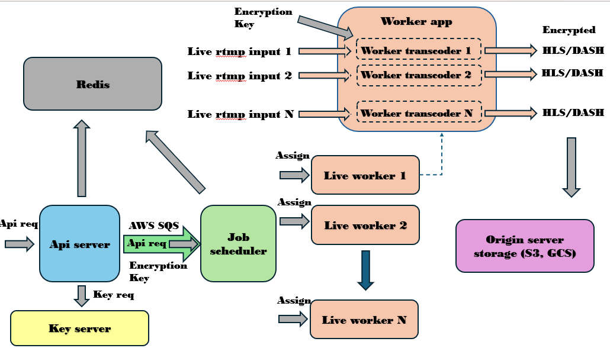

The API server exposes API endpoints to users for submitting and managing their live streams. The API server receives job requests from users and sends them to the job scheduler via a job queue (**AWS Simple Queue Service**). The job scheduler receives a new job request from the job queue, picks a live worker from the worker cluster then assigns the job request to it. The selected live worker launches ffmpeg/shaka packager instances to run the live channel. For live jobs with DRM protection configured, the API server requests DRM encrypt/decrypt key from ezKey_server, pass it to Shaka packager along with other DRM configurations for stream encryption. The API server uses a stateless design which the server does not maintain any in-memory states of live jobs. Instead, all the states are kept in Redis data store. 

## Live stream data flow

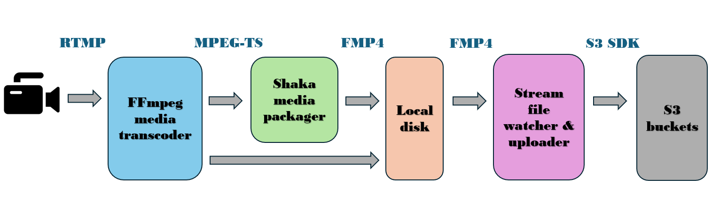

The live stream data flow on a live worker server is shown in the above diagram. To run a live channel, the worker launches a ffmpeg transcoder and a Shaka packager. From left to right, the contribution encoder generates and sends a live RTMP stream (SRT to be added) to the ffmpeg transcoder. The ffmpeg transcoder outputs *N* number of output MPEG-TS streams, where *N* is the number of configured output renditions in the live job request. The MPEG-TS streams are sent to Shaka packager running on the same VM. Shaka packager outputs HLS/DASH streams as fragmented MP4 segments and playlist files and write to local disk. The worker runs a file watcher (fsnotify) which watches for new files written to the local stream output folders, then uploads any new files to the configured S3 bucket (i.e., S3_output.Bucket). The S3 buckets serves as the origin server which can deliver HLS/DASH streams to the viewers via CDN.

# Quickstart

All the microservices in ezLiveStreaming run in docker and can be built, created and launched with docker-compose in a few steps as follows. 

## Prerequisites:

- Two physical or virtual servers: they can be your own PCs, or cloud virtual machines on AWS EC2 or Google Cloud Compute. In reality, all the ezLiveStreaming services can be packed on a single machine. This is what I have been doing for my own dev and test. However, for a more general demonstration, I'm using a two server setup. 

- You need to install docker, docker-compose and git. On some OSes such as Amazon Linux, docker-compose needs to installed separately from docker.

- You need to install live broadcasting software such as OBS studio (https://obsproject.com/download), Wirecast or ffmpeg on any machine with camera.

- You need to create a S3 or GCS bucket to store the media output from ezLiveStreaming's transcoder. You need to get a copy of the AWS access key and secret key pair as they will be passed to ezLiveStreaming for accessing AWS SQS or uploading transcoder outputs to AWS S3.

## Step 1: Launch the servers
Launch two EC2 instances, one for running ezLiveStreaming's management services such as API server, job scheduler, DRM key server and Redis, and another one for running a live transcoding worker. The microservices of ezLiveStreaming runs on a base docker image built out of Ubuntu 22.04. The management services do not eat a lot of resource so they can run on relatively low-end instances (I use a t2-micro one which is free-tier eligible). The live worker services could run multiple live ABR transcoding jobs so they must run on a more powerful instance (I use a c5-large one). But if you only run a single live job with low bitrate output, you may also use less powerful instances.

## Step 2: Download the ezLiveStreaming source
On both management and worker servers, check out the source code from github.
```
git clone https://github.com/maxutility2011/ezLiveStreaming.git
```
```
cd ezLiveStreaming/
```
We will run the management services on one instance, and the live worker services on the other.

## Step 3: Configure AWS access and grant to ezLiveStreaming services
Configure aws on both instances if you haven't done so already. ezLiveStreaming uses AWS services such as SQS and S3.
```
aws configure
```
Enter your AWS access key, secret key, default region, etc as prompted. Please refer to https://docs.aws.amazon.com/IAM/latest/UserGuide/id_credentials_access-keys.html for how to get the secrets. Two files, *~/.aws/config* and *~/.aws/credentials* will be generated after running *aws configure*. Next, please make these two files accessible to any users. 
```
chmod 644 ~/.aws/credentials
```
```
chmod 644 ~/.aws/config
```

The docker compose file, *compose.yaml* maps *~/.aws/* in the docker host machines to */home/streamer/.aws/* in the docker containers, so that the services inside docker receive AWS access from the mapped credential. The live transcoder process inside the worker container runs as user *streamer* which is different to the user on your host machines. To allow user *streamer* to access */home/streamer/.aws/* which is owned by a different user, we need to make that folder accessible to any user. 

## Step 4: Create live job queue on AWS SQS
Create an AWS SQS queue by following https://docs.aws.amazon.com/AWSSimpleQueueService/latest/SQSDeveloperGuide/sqs-getting-started.html and pick any queue name that you like. This will be the live transcoding job queue which will be used by the API server and job scheduler to transfer live transcoding jobs. Please put the queue name in *Sqs.Queue_name* of *ezLiveStreaming/api_server/config.json* and *ezLiveStreaming/scheduler/config.json*. ezLiveStreaming will use the configured AWS secrets in step 3 to access the job queue.

## Step 5: Configure the services

The api_server, job scheduler, ezKey_server and worker_app all have their own configuration files.

In *api_server/config.json*, put your own job queue name in *Sqs.Queue_name*. 

In *scheduler/config.json*, put your own job queue name in *Sqs.Queue_name*. 

No change is needed in *drm_key_server/config.json*.

In *worker/app/worker_app_config.json*, put in your own *SchedulerUrl*. The host name part of *SchedulerUrl* is the host name or IP address of your management server. The network port is 3080 by default, otherwise it must match that scheduler port configured in *scheduler/config.json*. You can leave other configuration options as is.

## Step 6: Networking
As a general note, please ensure all the url, hostname/ip_address, network port you put into the configurations files are accessible from other services. For example, make sure the worker service can reach the job scheduler service using the configured *SchedulerUrl*. Please also make sure any configured network ports are open in the firewall. 

List of public ports that need to be opened,

| Port/Port range | Server | Service | Protocol | Use | 
| --- | --- | --- | --- | --- |
| 1080 | management | api_server| HTTP (TCP) | Used by api_server to receive live job requests from users | 
| 2080 | worker | worker | HTTP (TCP) | Used by worker to communicate with job scheduler | 
| 3080 | management | job scheduler | HTTP (TCP) | Used by job scheduler to communicate with workers | 
| 4080 | management | Nginx | HTTP (TCP) | Used by Nginx to serve the demo UI. |
| 1935-1940 | worker | worker | RTMP (TCP) | Used by a worker to receive live rtmp input streams, one port per stream |

The ezKey_server uses port 5080 for serving DRM key requests. However, since ezKey_server runs on the same host server as api_server, port 5080 does not need to be made public.

## Step 7: Build the services
On the management server, build the management services,
```
docker compose build api_server scheduler --no-cache
```
In [compose.yaml](compose.yaml) definition, api_server relies on ezKey_server and redis, so building api_server will automatically build the two dependent services.

On the worker server, build the live transcoding worker service,
```
docker compose build worker --no-cache
```
The build process will take about 1-2 minutes on its initial run. The docker compose file, [compose.yaml](compose.yaml) will create docker images for all the services and set up the management and worker cluster. All the ezLiveStreaming docker images will be created out of a base image,
https://hub.docker.com/repository/docker/maxutility2011/ezlivestreaming_baseimage/general.

## Step 8: Start the services
On the management server, start **api_server** and **scheduler**.
```
docker compose up api_server
```
```
docker compose up scheduler
```
On the worker server, start an instance of **worker**.
```
docker compose up worker
```
The order of starting services does not matter. The services will connect to each other automatically.

## Step 9: Start your live channel from the UI
On your web browser, load the ezLiveStreaming demo UI page, e.g., http://ec2-34-202-195-77.compute-1.amazonaws.com:4080/demo/demo.html. In the URL, replace the EC2 hostname with your own management server hostname. Again, please make sure port 4080 is open to the Internet. 

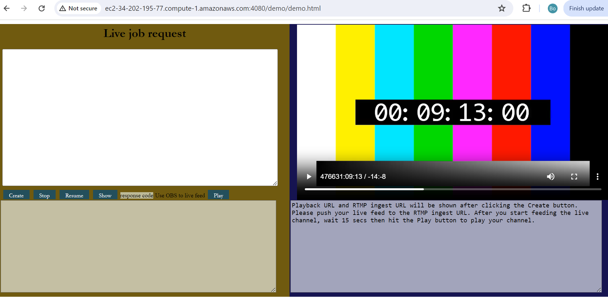

Copy the content of [sample_live_job_without_drm.json](sample_live_job_without_drm.json), and paste it under *Live Job Request*. Put your S3 bucket name in *S3_output.Bucket* of the live job request, then click the "create" button. This will send a create_job request to the api_server to create a new live channel. The server response will be shown on the bottom-left corner of the UI which includes the details of the new job. You will see a job ID, e.g., "4f115985-f9be-4fea-9d0c-0421115715a1". The bottom-right corner will show the essential information needed to set up the live RTMP input feed and to play the live HLS/DASH stream after the live RTMP input is up. If you want to enable clear-key DRM, you can copuy-paste the content of [sample_live_job.json](sample_live_job.json) to create a protected live channel. Detail of about DRM setup will be explained later.

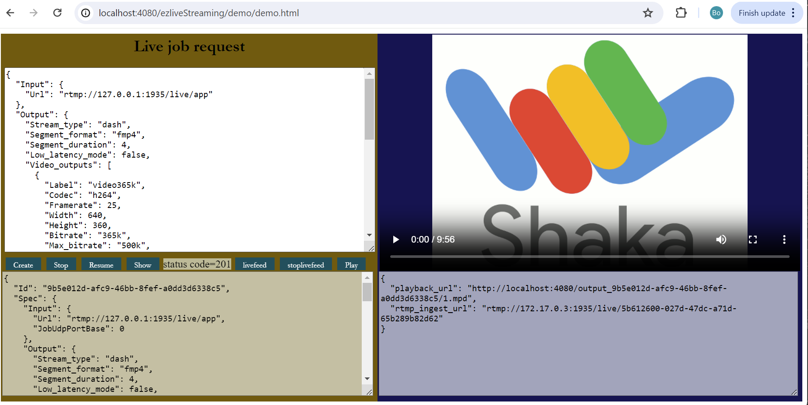

On the worker server, verify the worker container is running,
```
docker ps
```
Expect output as follows,
```
[ec2-user@ip-172-31-20-123 ~]$ docker ps
CONTAINER ID   IMAGE                                   COMMAND                  CREATED        STATUS          PORTS                                                                                                                          NAMES
1abfdfe0f6fe   maxutility2011/ezlivestreaming_worker   "/bin/sh -c '/home/s…"   20 hours ago   Up 13 minutes   0.0.0.0:1935-1950->1935-1950/tcp, :::1935-1950->1935-1950/tcp, 1080/tcp, 4080/tcp, 0.0.0.0:2080->2080/tcp, :::2080->2080/tcp   ezlivestreaming-worker-1
```
Log into the worker container, e.g.,
```
docker exec -it 1abfdfe0f6fe /bin/bash
```
Inside the worker container, switches to user "streamer" and verify the worker services are running under user "streamer",
```
su - streamer
ps aux
```
Expect output as follows,
```
streamer@1abfdfe0f6fe:~$ ps aux
USER         PID %CPU %MEM    VSZ   RSS TTY      STAT START   TIME COMMAND
streamer       1  0.0  0.1   2800  1080 ?        Ss   07:25   0:00 /bin/sh -c /home/streamer/bins/worker_app -config=/home/streamer/conf/worker_a
streamer       7  0.1  2.7 1231516 26376 ?       Sl   07:25   0:00 /home/streamer/bins/worker_app -config=/home/streamer/conf/worker_app_config.j
streamer      31  0.0  1.1 1237864 10856 ?       Sl   07:29   0:00 worker_transcoder -job_id=4f115985-f9be-4fea-9d0c-0421115715a1 -param={"Input"
streamer      35  0.0 10.5 1091680 102280 ?      Sl   07:29   0:00 packager in=udp://127.0.0.1:10001,stream=video,init_segment=/tmp/output_4f1159
streamer      42  0.0  4.4 275364 43424 ?        SL   07:29   0:00 ffmpeg -f flv -listen 1 -i rtmp://0.0.0.0:1936/live/5ae4760f-49a0-41a9-979d-00
streamer      49  0.3  0.4   4588  3964 pts/0    Ss   07:39   0:00 /bin/bash
root          60  0.0  0.3   6744  3740 pts/0    S    07:39   0:00 su - streamer
streamer      61  0.0  0.4   5016  4204 pts/0    S    07:39   0:00 -bash
streamer      68  0.0  0.4   8332  4140 pts/0    R+   07:39   0:00 ps aux
```
If the new channel is up and running, you should see 4 worker processes running: 
- worker_app
- worker_transcoder
- packager (Shaka packager)
- ffmpeg

The ffmpeg process is ready to receive your live RTMP input stream.
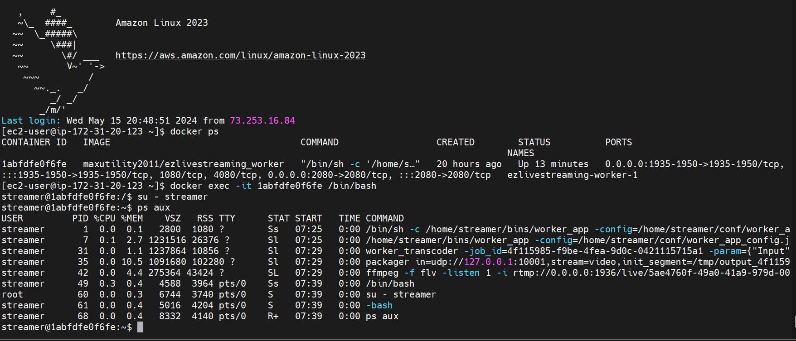

## Step 10: Feed your live channel
On your PC, open OBS studio to broadcast a live RTMP contribution stream. Go to the demo UI and copy the *rtmp_ingest_url*, e.g., "rtmp://54.91.250.183:1936/live/5ae4760f-49a0-41a9-979d-005fe9c32834". In OBS, click "Settings", 

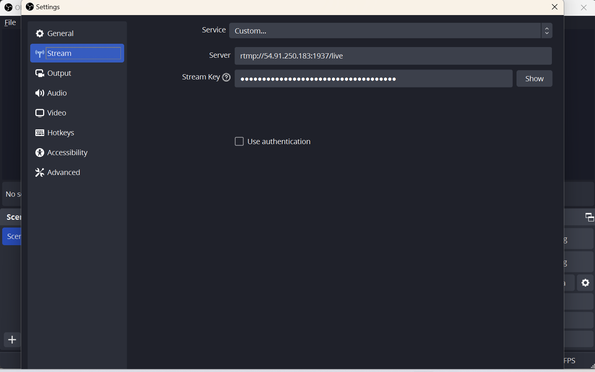

Copy-paste the RTMP URL address, e.g., "rtmp://54.91.250.183:1936/live/" into the "Server" section, and the RTMP stream key, e.g., "5ae4760f-49a0-41a9-979d-005fe9c32834" into the "Stream Key" section. Click "OK" to save and apply the RTMP output settings. Then, click "Start Streaming" button to start live broadcasting to ezLiveStreaming. If OBS returns no error, that means the live broadcasting is up and running.

## Step 11: Verify live channel output to S3
Go to your AWS s3 console, click into your bucket, you will see a folder named as follows, "output_4f115985-f9be-4fea-9d0c-0421115715a1/". The string after "output_" is the live job id which should match the job id returned from the api_server in step 9. Click into the job media output folder, you will see media output as follow,

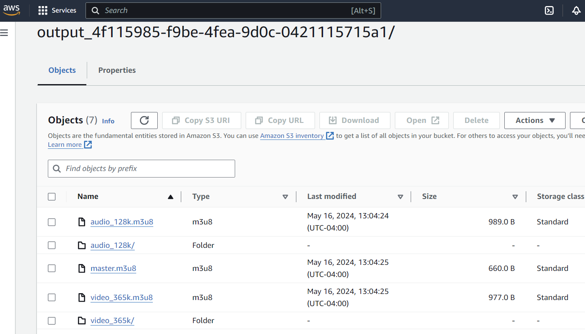

For HLS, media output include m3u8 playlists and sub-folders that contains media segments. \br

However, if you don't see the job output folder in your bucket, that may indicate missing AWS access right. Log into your worker container again as in step 9, run 
```
vi /home/streamer/log/worker_transcoder_4f115985-f9be-4fea-9d0c-0421115715a1.log
```
to view the worker log. You may see S3 upload failure due to missing AWS access right.

## Step 12: Playback
The live channel playback URL can be found in the botton-right corner of the demo UI, e.g., "https://bzhang-test-bucket-public.s3.amazonaws.com/output_4f115985-f9be-4fea-9d0c-0421115715a1/master.m3u8".
In the demo UI, I integrated Shaka player to play the live channel. After you started live broadcasting in step 10, wait about 10-15 seconds then click the "play" button in the UI. You will see playback starts. You can also use Shaka player's official demo page (https://shaka-player-demo.appspot.com/demo) to play your live channel. If you haven't enabled allow-cors (cross-origin) in S3, the playback could fail due to CORS errors. In that case, you can install **Moesif CORS** browser extension and enable CORS then click "play" button again.

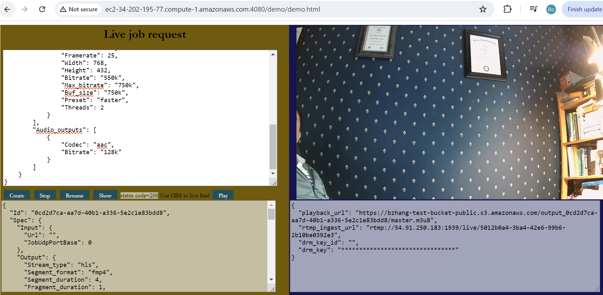

# List of API methods

## Create Job
Creating a new live transcoding request (a.k.a. live transcoding job or live job) <br>
**POST /jobs** <br>
**Request body**: JSON string representing the live job specification <br>
```
{
    "Output": {
        "Stream_type": "hls", 
        "Segment_format": "fmp4", 
        "Fragment_duration": 1, 
        "Segment_duration": 4, 
        "Low_latency_mode": false, 
        "Time_shift_buffer_depth": 120,
        "Drm": {
                "disable_clear_key": false,
                "Protection_system": "FairPlay",
                "Protection_scheme": "cbcs"
        },
        "S3_output": {
            "Bucket": "bzhang-test-bucket-public"
        },
        "Video_outputs": [ 
            {
                "Label": "video365k", 
                "Codec": "h264", 
                "Framerate": 25, 
                "Width": 640, 
                "Height": 360, 
                "Bitrate": "365k", 
                "Max_bitrate": "500k", 
                "Buf_size": "500k", 
                "Preset": "faster", 
                "Threads": 2 
            },
            {
                "Label": "video550k",
                "Codec": "h264",
                "Framerate": 25,
                "Width": 768,
                "Height": 432,
                "Bitrate": "550k",
                "Max_bitrate": "750k",
                "Buf_size": "750k",
                "Preset": "faster",
                "Threads": 2
            }
        ],
        "Audio_outputs": [
            {
                "Label": "audio128k",
                "Codec": "aac",
                "Bitrate": "128k" 
            }
        ]
    }
}
```
**Response code** on success: 201 created <br>
**Response body**: on success, the server returns the original request body, plus the created job ID, timestamps and job state. <br>


## Transcoding parameter definitions

| Param | Data type | Definition | Valid values |
| --- | --- | --- | --- |
| Stream_type | string | stream type (protocol) | "hls", "dash" |
| Segment_format | string | media segment format | "fmp4", "mpegts", "cmaf" |
| Fragment_duration | integer | fragment (GOP) duration in second. Currently, this will set the closed GOP size and key frame interval | n/a |
| Segment_duration | integer | duration of segments in second | n/a |
| Low_latency_mode | boolean | whether low latency mode is used | n/a |
| Time_shift_buffer_depth | integer | DASH time_shift_buffer_depth in second (applicable to HLS too), i.e., DVR window size | n/a |
| Drm | json | DRM configuration | n/a |
| disable_clear_key | boolean | whether clear key DRM is disabled | n/a |
| Protection_system | string | DRM protection system | "FairPlay" (other systems to be added, e.g., "Widewine"m "PlayReady") |
| Protection_scheme | string | DRM protection (encryption) scheme | "cbcs", "cenc" |
| S3_output | json | S3 output configuration | n/a |
| Bucket | string | S3 bucket name | n/a |
| Video_outputs | json array | Array of video output renditions | n/a |
| Label | string | label of an output rendition | n/a |
| Codec (Video_outputs) | string | video codec | "h264" (libx264), "h265" (libx265) |
| Framerate | integer | output video frame rate | n/a |
| Width | integer | output video resolution (width) | n/a |
| Height | integer | output video resolution (height) | n/a |
| Bitrate | string | output video bitrate (corresponds to "-b:v" in ffmpeg) | for example, "500k", "1m" |
| Max_bitrate | string | output video bitrate cap (corresponds to "-maxrate" in ffmpeg) | for example, "750k" |
|Buf_size | string | VBV buffer size (corresponds to "-bufsize" in ffmpeg) | for example, "750k" |
| Preset | string | video encoding speed preset (corresponds to "-preset" in ffmpeg) | same as libx264 or libx265 presets |
| Threads | integer | number of encoding threads (corresponds to "-threads" in ffmpeg) | same as ffmpeg "-threads" values |
| Audio_outputs | json | array of audio outputs | n/a |
| Codec (Audio_outputs) | string | audio codec | "aac" |

## Get all the jobs
Show all the jobs including currently running jobs and already finished jobs. <br>
**GET /jobs** <br>
**Request body**: None <br>
**Response code** on success: 200 OK <br>
**Response body**: A JSON array that lists all the jobs. <br>

## Get one job
List a single job given by its ID. <br>
**GET /jobs/[job_id]** <br>
**Request body**: None <br>
**Response code** on success: 200 OK <br>
**Response body**: the requested job <br>

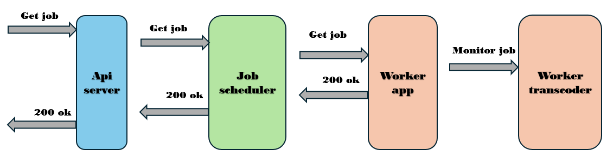

## Stop a job
Stop a job given by its ID. Upon request, the associated worker_transcoder instance will be stopped but the job info and states will remain in Redis. When the job is resumed in the future, the job ID, stream key and all the transcoding and packaging parameters remain the same. <br>

**PUT /jobs/[job_id]** <br>
**Request body**: None <br>
**Response code** on success: 202 Accepted <br>
**Response body**: None <br>

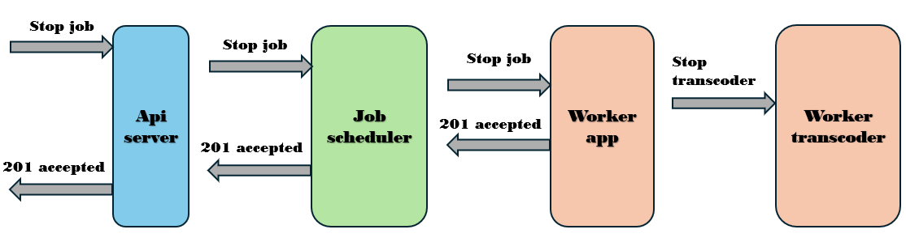

## Resume a job
Resume a job given by its ID. Upon request, the stopped job will be resumed. A new worker_transcoder instance will be launched. The job ID and stream key and all the transcoding and packaging parameters will be reused. <br>

**PUT /jobs/[job_id]** <br>
**Request body**: None <br>
**Response code** on success: 202 Accepted <br>
**Response body**: None <br>

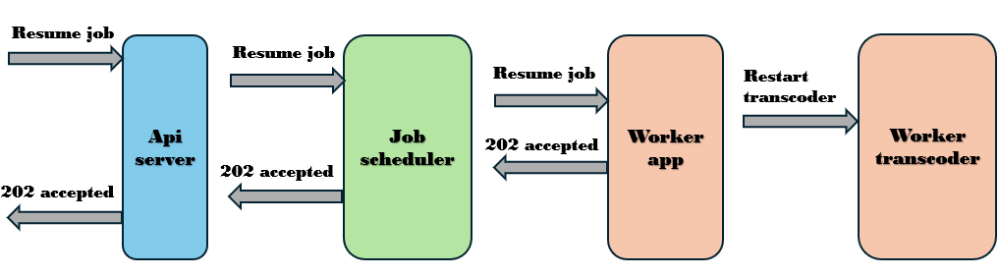

This repository also provides a postman collection including all the external and internal API provided by the API server, the job scheduler and worker_app.

The job scheduler periodically polls the job queue and fetches a job from AWS SQS. The frequency of job queue polling must be set low to avoid any delay of job processing. The newly fetched jobs are inserted to the back of the "queued_jobs" list in Redis. On the other side, the job scheduler periodically checks the front of "queued_jobs" for new jobs. When a new job is found in the "queued_jobs", it is assigned to a transcoding worker from the worker cluster. Different job assignment algorithms can be used, such as random assignment, round robin assignment, etc. The job scheduler is responsible for managing a live job throughout its lifecycle, for example, assigning the job to a worker, monitoring its status, restarting/reassigning the job if it fails. 

The job scheduler also manages a cluster of live transcoding workers. Specifically, the scheduler assigns ID to each new worker when it starts. After that, the scheduler keeps monitoring heartbeats sent from the worker. The scheduler also monitors workload of each worker as new job requests come in and get finished. 

Though the job scheduler manages all the live jobs and live workers, it does not maintain any states of them in memory, instead they are all kept in Redis. Because of its stateless design, one can put a load balancer in front of a cluster of independent job scheduler instances, so that any one instance can be assigned to handle any job requests or events from the workers. 

Each live worker is a virtual machine that runs ezLiveStreaming worker services. The worker runs a web service daemon called worker_app which communicates with the job scheduler to receive job requests, report job status, or worker status, etc. When the worker_app receives a live job request from the scheduler, it launches an instance of **worker_transcoder** to execute the job. Specifically, the worker_transcoder launches a ffmpeg transcoder and a Shaka packager to run a live video channel. The worker_transcoder follows the transcoding/packaging parameters specified in the live job request to transcode the input to multiple outputs with different bitrates. *job/command.go* is responsible for translating the live encoding parameter to ffmpeg and Shaka packager command-line options.

When worker_app on a live worker first starts, it registers with the job scheduler and receives a worker ID assigned by the scheduler. After that worker_app needs to send periodic heartbeat to the scheduler so that the latter knows the former is still running. If no heartbeat is received from a worker for a certain length of time, the scheduler presumes that worker is no longer running so it deletes the worker from the active worker set and also stops all the live jobs running on that worker. The worker_app also handles **stop_job** requests and **resume_job** requests to stop a running job or resumes a stopped job. 

A worker_app not only handles normal job requests, it also handles unexpected job failures. To detect failed jobs, a worker_app periodically ping the live jobs (worker_transcoders) running on that worker VM. If a worker_transcoder does not respond, the worker_app presumes that the corresponding live job is no longer running. The worker_app reports the failed jobs to the job scheduler. The latter will adjust workload accordingly.

# DRM configuration

A simple clear key DRM key server is implemented to generate random 16 byte key-id and key upon requests. Each live channel receives an unique key-id and key pair. Specifically, api_server sends a key request to the key server when it receives a new transcoding job with DRM protection configured. The transcoding job ID is used as the content ID for the live channel. The key server generates a random 16 byte key_id and key pair then associate them with the content ID. The api_server receives the key response, parse the key materials from the response, then pass it along with the job request (including the DRM protection configuration) to the scheduler followed by the worker_app and worker_transcoder. The worker_transcode translates the key materials and DRM configuration to Shaka packager DRM options when launching the packager. Lastly, the packager encrypts the live transcoded streams (received from ffmpeg) and outputs DRM-protected HLS streams. For clear-key DRM, a key file named *key.bin* is output and uploaded to S3. As per HLS specification, for clear key DRM, key.bin is a public file which contains the decrypt key in binary format. Its S3 URI is included the *EXT-X-KEY* tag in the variant playlist. The player can download the key file to access the decrypt key. Note that clear-key DRM is ONLY for testing and debugging purposes. A full DRM workflow is needed to keep you content secure.

```
"Drm": {
    "disable_clear_key": false,
    "Protection_system": "FairPlay",
    "Protection_scheme": "cbcs"
},
```
Particularly we must set *disable_clear_key* to false in order to use clear-key protection scheme. Supporting a full DRM workflow requires integration with 3rd party DRM services which I am happy to work on if sponsorship is provided. Currently, only video variants are DRM-protected, audio variants are not.

To play the clear-key DRM-protected HLS stream, I used the Shaka player demo (https://shaka-player-demo.appspot.com/demo) and configured key_id and key . I simply added the following section to the Shaka player "extra config" section,
```
{
  "drm": {
    "clearKeys": {
      "6185c9f2cba899e585c61f046ac5bfe7": "459ad6f73d96190c8348d0059d71f77a"
    }
  }
}
```
Please replace the key_id and key with your ones. The above configuration tells Shaka player what key to use to decrypt the HLS media segments. Next, please copy-paste the HLS master playlist url into Shaka player demo (https://shaka-player-demo.appspot.com/demo) and hit "play" button. 

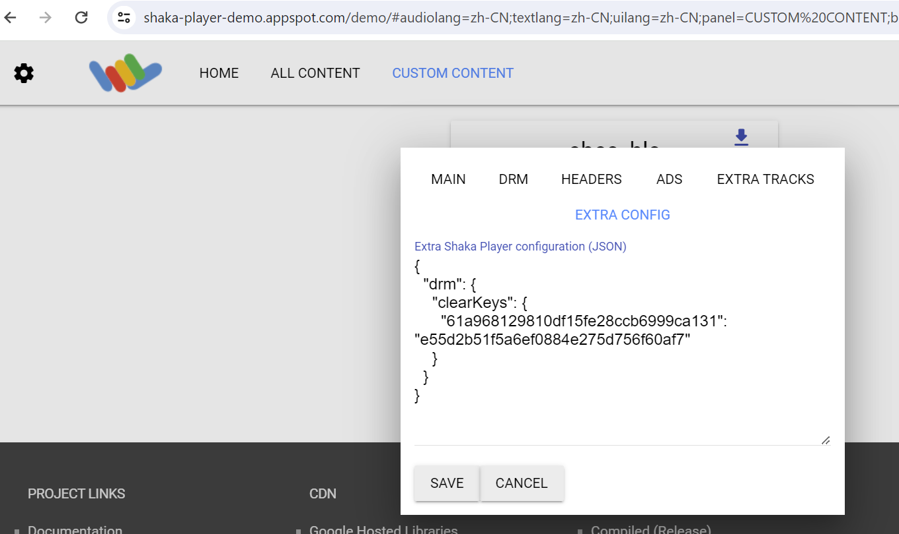

### How to get the DRM key_id and key
The DRM key_id (but not the decrypt key) can be found in the get_job response from api_server. Please use the key_id and get_drm_key request provided by ezKey_server (in the postman collection) to retrieve the decrypt key. Do NOT expose the ezKey_server API to the Internet!!! Alternatively, a DRM key info file (called key.json) is written to local disk (but not uploaded to S3) along with the key file (key.bin). The decrypt key can be found there.

Actually, the above DRM key configuration is not needed if you play the individual variant playlists. Shaka player will download the key file (key.bin) which is given by the *URI* field in the *EXT-X-KEY* tag and get the decrypt key. I haven't figured out why individual variant playlists work but not the master.

# S3 output configuration

ezLiveStreaming supports uploading transcoder outputs to AWS S3 buckets. You can configure S3 media output via the "S3_output" section,
```
"S3_output": {
    "Bucket": "bzhang-test-bucket-public"
}
```
Currently, ezLiveStreaming does not support programmatic S3 authentication methods. You may configure AWS access key and secret key as environment variables on the worker VM, so that worker_transcoder has access to upload to the bucket.

# Code structure

**api_server/** contains the implementation of a live streaming API server which handle requests to create/list/stop/resume live streams.

**demo/** provides the implementation of a simple UI demo. <br>

**drm/** provides the implementation of a simple DRM key server. <br>

**job/** contains the definition of API requests and live job states, and also contains source code for generating FFmpeg (or other encoder library such as GStreamer) commands that are used to execute a live job. <br>

**job_sqs/** contains the implementation of a AWS Simple Queue Service (SQS) sender and receiver. The api_server sends new live jobs to the job queue (AWS SQS). The job scheduler periodically polls the job queue to receive new jobs. <br>

**model/** contains various model definitions. <br>

**redis_client/** implements a redis client wrapper based on go_redis (https://github.com/redis/go-redis). <br>

**scheduler/** contains the implementation of a live job scheduler. Job scheduler receives new live jobs from the api_server via a AWS SQS job queue. Job scheduler also exposes API endpoints and receives new live worker registration requests from newly launched workers. <br>

**worker/** contains the implementation of live transcoding/streaming workers. The file *app/worker_app.go* implements the main application of the live worker. There is only one worker_app running on each live worker. worker_app receives live transcoding jobs from the job scheduler, launch new worker_transcoder (*worker/transcoder/worker_transcode.go*) to process live inputs and generate outputs, sends hearbeat periodically to the job scheduler, reports status of jobs and current workload to the job scheduler, etc. *worker/* also contains the Shaka packager binary "packager" (the nightly build from 04/2024).
<br>

**sample_live_job.json** contains a sample live job request. <br>

**ezLiveStreaming.postman_collection.json** provides sample API requests to ezLiveStreaming in a postman collection.

There are five executables, **api_server**, **job scheduler**, **worker_app**, **worker_transcoder** and **ezKey_server**. The entire live transcoding system consists of a cluster of api_server(s), a cluster of job schedulers, a cluster of redis servers and a cluster of live workers. Neither an api_server nor a job scheduler maintains any states of the live transcoding requests. The stateless design allows easy scalability and failover. As a result, one can put a load balancer (such as Nginx) in front of the api_server cluster and the job scheduler cluster. For example, you can use the "*upstream*" directive (https://docs.nginx.com/nginx/admin-guide/load-balancer/tcp-udp-load-balancer/) to specify a cluster of equivalent api_server instances which any one of them can handle the live transcoding requests. The api_server and job scheduler does not communicate directly, rather they communicate via the AWS SQS job queue and Redis. 

On each live worker VM, there runs one instance of worker_app which manages all the live jobs running on the VM. Each live job is executed by one instance of worker_transcoder which coordinates the live transcoder and the live packager to ingest, transcode and package the HLS/DASH live output stream. worker_app is a long-standing daemon while worker_transcoder only lives when a live job is still alive.

# Build and run

To build api_server, go to *api_server/* and run 
```
go build api_server_main.go
```
then start the server by running
```
./api_server_main -config=config.json
``` 
You can configure api_server_main in the config file. Specifically, you can configure the server hostname and network port, Drm key server url, and the AWS SQS job queue name and Redis server address in *api_server_main/config.json*. By default, the api_server listens for incoming live transcoding requests on http://0.0.0.0:1080/. This is also the base URL of any API endpoints that the server supports. You need to open port 1080 for incoming traffic to the Internet.

To build the job scheduler, go to *scheduler/* and run 
```
go build scheduler.go
``` 
then start the job scheduler by running 
```
./scheduler -config=config.json
``` 
You can configure scheduler in the config file. Specifically, you can set the server hostname and network port of the scheduler, and the AWS SQS job queue name and Redis server address in *scheduler/config.json*. By default, the scheduler listens for incoming requests on http://0.0.0.0:80/.

To build worker_app, go to *worker/app/* and run 
```
go build worker_app.go
``` 
then start the worker by running 
```
./worker_app -config=worker_app_config.json
```
The "*-config*" argument specifies the path to the worker_app configuration file. In the *worker_app_config.json*, you can configure,
- the hostname and network port of the worker_app. 
- the URL of the job scheduler. The worker_app sends heartbeat, reports status of jobs via this URL.
- the IP address or hostname, and network port of the worker VM on which the worker_app runs.
- WorkerUdpPortBase: the UDP port base used by the MPEG-TS streams between ffmpeg transcoder and Shaka packager. Since ffmpeg and Shaka packager run on the same VM, these ports are for internal use only.

To build ezKey_server, go to *drm/* and run 
```
go build ezKey_server.go
``` 
then start the key server by running
```
./ezKey_server -config=config.json
```

You can write your own docker compose file and/or scripts to automate the deployment of your api_server cluster, the job scheduler cluster, the worker cluster and Redis cluster. I'm also working on providing a sample docker compose file.

You need to configure AWS access to allow the api_server and job scheduler to access AWS SQS - the job queue. Specifically, you need to configure the following environment variables,
```
export AWS_ACCESS_KEY_ID=[your_aws_access_key]
export AWS_SECRET_ACCESS_KEY=[your_aws_secret_key]
export AWS_DEFAULT_REGION=[your_default_aws_region] (optional)
```

Please remember to create your own SQS queue first, and put the queue name in the api_server and scheduler config file.

Additionally, depending on where you install your worker_transcoder, ffmpeg and Shaka packager executables, you need to specify the path to the executable by configure the following environment variables,
```
export PATH=[path_to_your_worker_transcoder_binary]:$PATH
export PATH=[path_to_your_ffmpeg_binary]:$PATH
export PATH=[path_to_your_shaka_packager_binary]:$PATH
```

You may also configure path to api_server and job scheduler.

Here are a list of docker images that I have created or used for building ezLiveStreaming,
- **ezlivestreaming_server**: https://hub.docker.com/repository/docker/maxutility2011/ezlivestreaming_server  

This is for hosting both the api_server and job scheduler.

- **ezlivestreaming_worker**: https://hub.docker.com/repository/docker/maxutility2011/ezlivestreaming_worker

This is for hosting a single live worker including the worker_app and multiple instances of worker_transcoder.

https://hub.docker.com/_/redis

This is the official Redis image that I'm using.

# List of Redis data structures 
## "jobs": 
All live jobs - see REDIS_KEY_ALLJOBS in redis_client/redis_client.go. <br>
**Data structure**: hash table <br>
**key**: job id <br>
**value**: "type LiveJob struct" in job/job.go <br>

To view all jobs in redis-cli, run "hgetall jobs". <br>

## "queued_jobs": 
Jobs that are pulled from the SQS job queue by job scheduler, but yet to be scheduled - see REDIS_KEY_ALLJOBS in redis_client/redis_client.go. <br>
**Data structure**: list <br>
**value**: string of "type LiveJob struct" (job/job.go) <br>

## "workers":
The set of live workers currently being managed by the job scheduler - see REDIS_KEY_ALLWORKERS in redis_client/redis_client.go. <br>
**Data structure**: hash table <br>
**key**: worker id <br>
**value**: string of "type LiveWorker struct" (models/worker.go) <br>

To view all workers in redis-cli, run "hgetall workers". 

## "worker_loads": 
The current load of a worker: list of jobs running on the worker and its CPU and bandwidth load - see REDIS_KEY_WORKER_LOADS in redis_client/redis_client.go. <br>
**Data structure**: hash table <br>
**key**: worker id <br>
**value**: "type LiveWorker struct" in models/worker.go <br>

## "drm_keys":
This table stores all the DRM keys: see REDIS_KEY_DRM_KEYS in redis_client/redis_client.go. <br>
**Data structure**: hash table <br>
**key**: DRM key id <br>
**value**: "type KeyInfo struct" in models/drm.go <br>

# Demo
This repository provide a simple transcoding UI for demo purposes. The demo source code can be found at *demo/* folder,
- demo/demo.html: a simple UI html
- demo/live_demo_player.js: implements listener functions for the "Create", "Stop", "Resume" and "Show", "Livefeed", "Stoplivefeed" and "Play" buttons. Upon button click events, those listener functions will send API requests to the API server. 

Tis demo integrates with the Shaka player (https://github.com/shaka-project/shaka-player) for playing HLS and DASH streams. You don't need to worry about video playback. To set up the demo, you need to first start all the services (api_server, scheduler and at least one worker with worker_app running). You need to run a Nginx web server, https://hub.docker.com/_/nginx to host this demo. You can also use the same Nginx to deliver the HLS/DASH streams. By default, worker_transcoder writes the HLS/DASH streams (media segments and playlists) to /var/www/html/output_[live_job_id] on the docker container which hosts the worker_transcoder, e.g., */var/www/html/output_0e130071-0178-40a1-9a36-2cf80de789a7/*. To avoid cross-origin (CORS) errors, you may need to configure allow-cors in Nginx,
```
location / {
    root   /var/www/html;
    index  index.html index.htm;
    add_header 'Access-Control-Allow-Origin' '*';
}
```

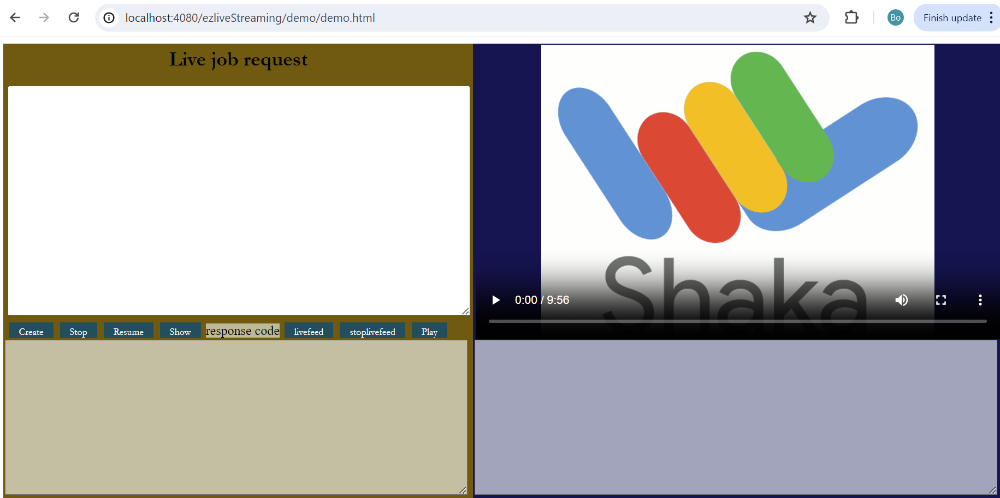
First, load the demo UI html in the web browser.


Next, click the "Create" button to create a new live stream. The default job request will be used and displayed in the job request editor on the top left corner. You may also edit the default job request.Clicking the "Create" button will send a "create_job" request to api_server. A new live job will be created and a worker_transcoder/ffmpeg instance will be launched. The API response from the api_server will be displayed in the text area on the bottom left corner. The RTMP ingest URL generated by worker_transcoder, and the HLS/DASH stream playback URL generated by the api_server will displayed in the text area on the botton right corner. You can use the RTMP ingest URL as the destination when pushing your live RTMP feed, however by default the demo will automatically push the big_buck_bunny video as a live input to worker_transcoder/ffmpeg. You can also copy the playback URL and play in any HLS/DASH video players, however by default the demo will automatically load the playback URL in Shaka player. The playback will start in about 20 seconds after you click the "Create" button.

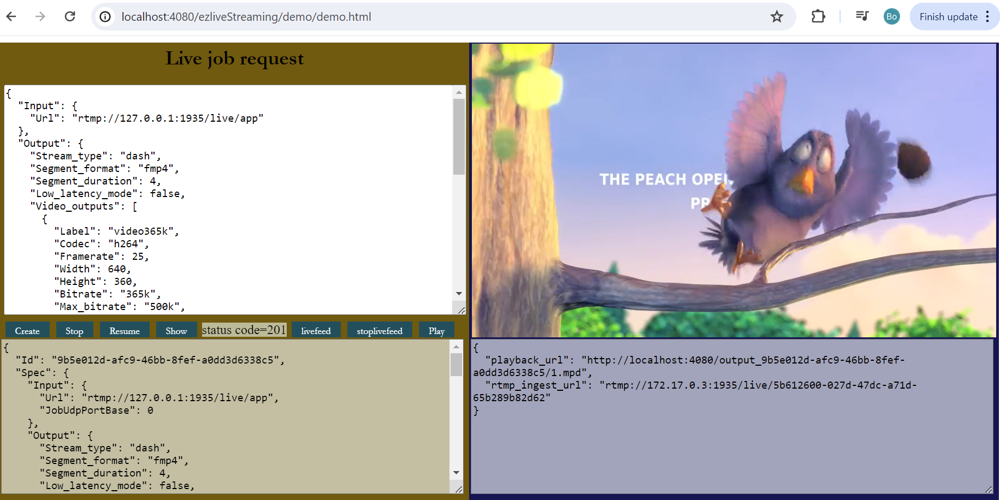

To stop the demo, you may click the "Stop" button or simply reload the demo page. When you reload the page, the demo program will send a stop_job request to api_server to stop the live stream and stop the worker_transcoder/ffmpeg instance running on the live worker.

