# ezLiveStreaming

ezLiveStreaming is a highly scalable and efficient live transcoding system written in Go. ezLiveStreaming provides friendly and industry-standard API for users to create and manage their live streams via web requests. A user can create a new live stream by submitting a *create_stream* request to the API server and specifying how she wants the live stream to be transcoded and streamed, for example, what transcoding a/v codec, resolution, bitrate and frame rate, etc. to use for transcoding video streams, and what protocols (Apple-HLS or MPEG-DASH) to use for streaming to the viewers. ezLiveStreaming outputs and uploads stream media segments and manifests/playlists to cloud origin servers such as AWS S3. The microservices in ezLiveStreaming are all containerized and clustered, and are built to be stateless so you can easily add or remove server instances when workload changes. A simple transcoding UI for demo purposes is also provided. However, in practice you may prefer to integrate ezLiveStreaming into your own systems through its live transcoding API. 

If you have any questions regarding this project, please email to Bo Zhang at maxutility2011@gmail.com.

## What can ezLiveStreaming do?

- live Adaptative BitRate (ABR) transcoding, 
- HLS/DASH streaming, 
- live transcoding API,
- live channel management API,
- live HLS streaming with AV1 video codec,
- clear key DRM protection, 
- uploading transcoder outputs to AWS S3,
- displaying live transcoding stats and live input stream info,
- standard-compliant media transcoding and formatting which potentially works with any video players.

## Supported media codecs
Video: 
- h.264,
- h.265,
- av1

Audio:
- aac
- mp3

## Roadmap

- Dynamic Ad Insertion (DAI)
- low-latency live streaming
- subtitles and captions
- multiple audio tracks
- timed metadata
- outputting log and stats to 3rd party data analytics platforms

# High-level architecture

ezLiveStreaming consists of 5 microservices that can be independently scaled,
- **api_server**: live API server
- **scheduler**: live job scheduler
- **worker**: live transcoding worker
- **ezKey_server**: a simple clear-key DRM key server 
- Redis data store

## Live stream management workflow
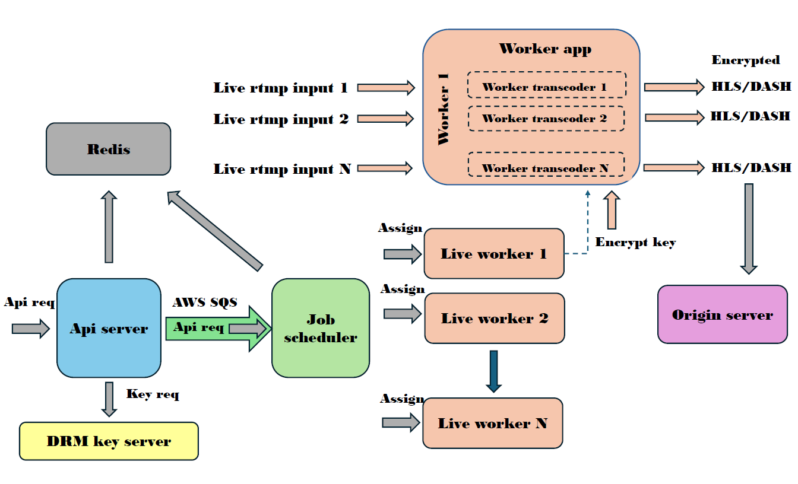

The API server exposes API endpoints to users for submitting new live job requests and managing their live channels. The API server receives job requests from users and sends them to the job scheduler via a **job queue** (**AWS Simple Queue Service**). The job scheduler receives a new job request from the job queue, picks a live worker from the worker cluster then assigns the new job to it. The selected live worker launches ffmpeg/shaka packager instances to run the live channel. For live jobs with DRM protection configured, the API server obtains DRM encrypt (decrypt) key from ezKey_server, pass it to Shaka packager along with other DRM configurations for stream encryption. The API server uses a stateless design which the server does not maintain any in-memory states of live jobs. Instead, all the states are kept in Redis data store. 

## Live stream data flow

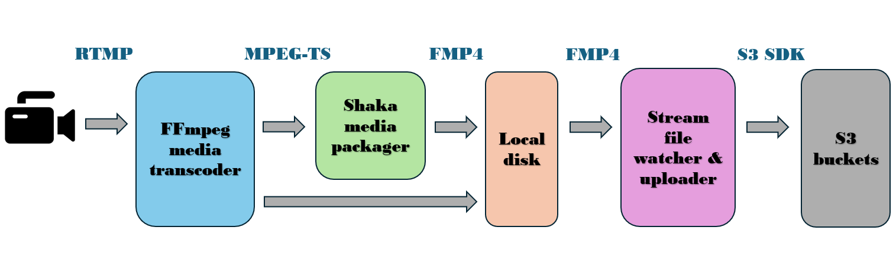

The live stream data flow on a live worker server is shown in the above diagram. To run a live channel, the worker launches a ffmpeg transcoder and/or a Shaka packager. From left to right, the contribution encoder generates and sends a live RTMP stream (SRT to be added) to the ffmpeg transcoder. The ffmpeg transcoder outputs *N* number of output MPEG-TS streams, where *N* is the number of configured output renditions in the live job request. The MPEG-TS streams are sent to Shaka packager running on the same VM. Shaka packager outputs HLS/DASH streams as fragmented MP4 segments and playlist files and writes to local disk. The worker runs a file watcher (fsnotify) which watches for new files written to the local stream output folders, then uploads any new files to the configured S3 bucket (i.e., S3_output.Bucket). The S3 buckets serves as the origin server which can deliver HLS/DASH streams to the viewers via CDN.

If a user specifies AV1 video codec, the worker only launches a ffmpeg instance for both transcoding and packaging. This is because Shaka packager currently does not recognize AV1 video encapsulated in MPEG-TS streams.

# How to integrate ezLiveStreaming

While the provided UI is only developed for demo purposes and can only serve a single live job, you can still use ezLiveStreaming's Web APIs to build your own Web catalog system to create and manage all your jobs. The detail of the APIs are specified in the following sections of this document. Your catalog system may provide one web page for creating new jobs and another page for listing all the current jobs. The new job page allows users to edit job request and submit to the server using the *create_job* API. The listing_jobs page allows users to view all the jobs using the *get_all_jobs* API. If users click on a specific job from the listing_jobs page, they are directed to a per-job page that shows the detail of that job. Users can also stop, reconfigure then resume a job from that page. All these behaviors are backed by the web API of ezLiveStreaming and its backend functions.

# Quickstart

This section shows how to set up a basic ezLiveStreaming system that consists of one instance of api_server, job scheduler, ezKey_server and a single instance of live transcoding worker. However, for any type of microservices, you can always scale up the cluster manually or via the autoscaling services provided by your cloud platforms. For example, you can run as many api_server instances behind a web API load balancer such as Nginx. You can also add as many live workers to the worker cluster to accommodate more live streams. The new workers will automatically connect to the job scheduler right after they are launched.  

All the microservices in ezLiveStreaming run in docker and can be built, created and launched with docker-compose in a few steps as follows. Through out this document, you will see terms like *live job*, *live channel* and *live stream* which are used interchangeably. 

## Prerequisites:

- Two physical or virtual servers: they can be your own PCs, or cloud virtual machines on AWS EC2 or Google Cloud Compute. In my demo setup, I use Ubuntu 24.04 for the management server and Amazon Linux 2023 for the live worker server. In reality, all the ezLiveStreaming services can be packed on a single machine. This is what I have been doing for my own dev and test. However, for a more general demonstration, I choose to use a two server setup. 

- You need to install **docker**, **docker-compose**, **git** and **aws-cli**. On some OSes such as Amazon Linux, docker-compose needs to installed separately from docker.

- You need to install live broadcasting software such as OBS studio (https://obsproject.com/download), Wirecast or ffmpeg on any machine with camera.

- You need to create a S3 or GCS bucket to store the media output from ezLiveStreaming's transcoder. You also need to get a copy of the AWS access key and secret key pair as they will be passed to ezLiveStreaming for accessing AWS SQS or uploading transcoder outputs to AWS S3.

The microservices of ezLiveStreaming runs on a base docker image built out of Ubuntu 24.04. Within the base image, ffmpeg 6.1.1 is pre-installed. 

## Step 1: Launch the servers
Launch two EC2 instances, one for running ezLiveStreaming's management services such as API server, job scheduler, DRM key server and Redis, and another one for running a live transcoding worker. The management services do not eat a lot of resource so they can run on relatively low-end instances (I use a t2-micro one which is free-tier eligible). The live worker services could run multiple live ABR transcoding jobs so they must run on a more powerful instance (I use a c5-large one). But if you only run a single live job with low bitrate output, you may also use less powerful instances.

## Step 2: Get ezLiveStreaming source
On both management and worker servers, get the source code from github.
```
git clone https://github.com/maxutility2011/ezLiveStreaming.git
```
```
cd ezLiveStreaming/
```
We will run the management services on one instance, and the live worker services on the other.

## Step 3: Configure and grant AWS access to ezLiveStreaming services
Configure aws on both instances if you haven't done so already. ezLiveStreaming uses AWS services such as SQS and S3.
```
aws configure
```
Enter your AWS access key, secret key, default region, etc as prompted. Please refer to https://docs.aws.amazon.com/IAM/latest/UserGuide/id_credentials_access-keys.html for how to get the secrets. Two files, *~/.aws/config* and *~/.aws/credentials* will be generated after running *aws configure*. Next, please make these two files accessible to any users. 
```
chmod 644 ~/.aws/credentials
```
```
chmod 644 ~/.aws/config
```

The docker compose file, [compose.yaml](compose.yaml) maps *~/.aws/* in the docker host machines to */home/streamer/.aws/* in the docker containers, so that the services inside docker receive AWS access from the mapped credential. The live transcoder process inside the worker container runs as user *streamer* which is different to the user on your host machines. To allow user *streamer* to access */home/streamer/.aws/* which is owned by a different user, we need to make that folder accessible to any user. Note that I chose to use volume mapping for granting AWS access to ezLiveStreaming services because it is simple while keeping my AWS secrets private. Granting AWS access is out of scope of this project.

## Step 4: Create live job queue on AWS SQS
Create an AWS SQS queue by following https://docs.aws.amazon.com/AWSSimpleQueueService/latest/SQSDeveloperGuide/sqs-getting-started.html and pick any queue name that you like. This will be the live transcoding job queue which will be used by the API server and job scheduler to transfer live transcoding jobs. Please put the queue name in *Sqs.Queue_name* of [api_server/config.json](api_server/config.json) and [scheduler/config.json](scheduler/config.json). ezLiveStreaming will use the configured AWS secrets in step 3 to access the job queue.

## Step 5: Configure the services

The api_server, job scheduler, ezKey_server and worker_app all have their own configuration files.

In [api_server/config.json](api_server/config.json), put your own job queue name in *Sqs.Queue_name*. 

In [scheduler/config.json](scheduler/config.json), put your own job queue name in *Sqs.Queue_name*. 

No change is needed in *drm_key_server/config.json*.

In [worker/app/worker_app_config.json](worker/app/worker_app_config.json), put in your own *SchedulerUrl*. *SchedulerUrl* allows the worker to find the job scheduler. The host name part of *SchedulerUrl* is the host name or IP address of your management server. The network port part of *SchedulerUrl* is 3080 by default, otherwise it must match that scheduler port configured in [scheduler/config.json](scheduler/config.json). If you have a cluster of job scheduler running behind a load balancer, you can put the URL of the load balance in *SchedulerUrl*. You can leave other configuration options as is. 

## Step 6: Network setup
As a general note, please ensure all the url, hostname/ip_address, network port you put into the configurations files are accessible from other services. For example, make sure the worker service can reach the job scheduler service using the configured *SchedulerUrl* ([worker/app/worker_app_config.json](worker/app/worker_app_config.json)). Please also make sure any configured network ports are open in the firewall. 

List of public ports that need to be opened,

| Port/Port range | Server | Service | Protocol | Use | 
| --- | --- | --- | --- | --- |
| 1080 | management | api_server| HTTP (TCP) | Used by api_server to receive live job requests from users | 
| 2080 | worker | worker | HTTP (TCP) | Used by worker to communicate with job scheduler | 
| 3080 | management | job scheduler | HTTP (TCP) | Used by job scheduler to communicate with workers | 
| 4080 | management | Nginx | HTTP (TCP) | Used by Nginx to serve the demo UI. |
| 1935-1950 | worker | worker | RTMP (TCP) | Used by a worker to receive live rtmp input streams, one port per stream |

The ezKey_server uses port 5080 for serving DRM key requests. However, since ezKey_server runs on the same host server as api_server, port 5080 does not need to be made public.

## Step 7: Build the services
On the management server, build the management services,
```
docker compose build api_server scheduler --no-cache
```
In [compose.yaml](compose.yaml) definition, api_server relies on ezKey_server and redis, so building api_server will automatically build the two dependent services.

On the worker server, build the live transcoding worker service,
```
docker compose build worker --no-cache
```
The build process will take about 1-2 minutes on its initial run. The docker compose file, [compose.yaml](compose.yaml) will create docker images for all the services and set up the management and worker cluster. All the ezLiveStreaming docker images will be created out of a base image,
https://hub.docker.com/repository/docker/maxutility2011/ezlivestreaming_baseimage/general.

On fresh installation, you probably need to start docker as a service after installing it, e.g., *sudo service start docker*. And on some OSes, you may need to change the permission of */var/run/docker.sock*, e.g., *sudo chmod 666 /var/run/docker.sock*.

## Step 8: Start ezLiveStreaming services
On the management server, start **api_server** and **scheduler**.
```
docker compose up api_server
```
```
docker compose up scheduler
```
On the worker server, start an instance of **worker**.
```
docker compose up worker
```
The order of starting services does not matter. The services will connect to each other automatically.

## Step 9: Start your live channel from the UI
The docker file for api_server copies the demo UI source to the Nginx web root (e.g., /var/www/html/demo/). When the API server is running, a Nginx web server will be running too and can serve the demo UI at the following URL, http://[api_server_hostname]:[api_server_port]/demo/demo.html. For example, http://ec2-34-202-195-77.compute-1.amazonaws.com:4080/demo/demo.html. On your web browser, load the ezLiveStreaming demo UI page. Again, please make sure port 4080 is open to the Internet. 

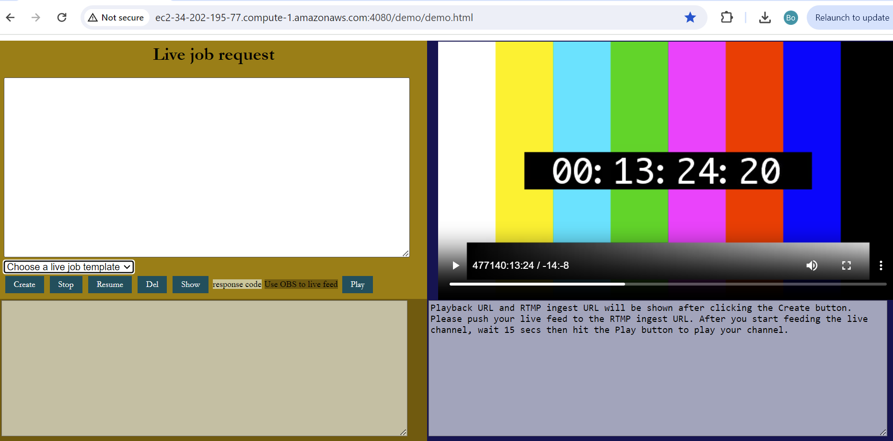

The demo UI provides a list of job request templates. Please choose one and the full job request will be shown in the editor section. Currently, 3 templates are provided,
- hls live with clear-key drm
- hls live without drm 
- hls live with av1 codec

After the job request is loaded in the editor, put your S3 bucket name in *S3_output.Bucket* of the live job request, then click the "create" button. This will send a create_job request to the api_server to create a new live channel. The server response will be shown on the bottom-left corner of the UI which includes the details of the new job. Among other things, you will see a job ID, e.g., "4f115985-f9be-4fea-9d0c-0421115715a1". The bottom-right corner will show the essential information needed to set up the live RTMP input feed and to play the live HLS/DASH stream after the live RTMP input is up. 

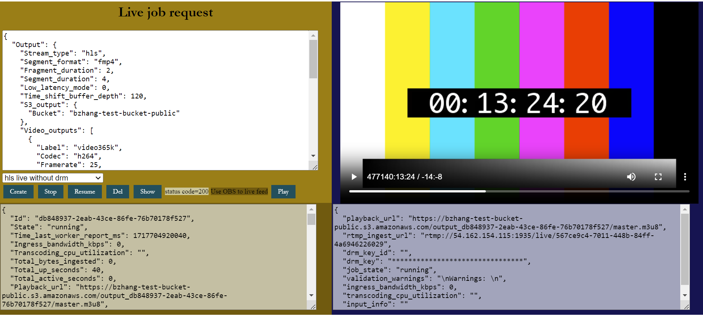

On the backend, ezLiveStreaming will create a new worker for your new channel. On the worker server, verify the worker container is running,
```
docker ps
```
Expect output as follows,
```
[ec2-user@ip-172-31-20-123 ~]$ docker ps
CONTAINER ID   IMAGE                                   COMMAND                  CREATED        STATUS          PORTS                                                                                                                          NAMES
1abfdfe0f6fe   maxutility2011/ezlivestreaming_worker   "/bin/sh -c '/home/s…"   20 hours ago   Up 13 minutes   0.0.0.0:1935-1950->1935-1950/tcp, :::1935-1950->1935-1950/tcp, 1080/tcp, 4080/tcp, 0.0.0.0:2080->2080/tcp, :::2080->2080/tcp   ezlivestreaming-worker-1
```
Log into the worker container, e.g.,
```
docker exec -it 1abfdfe0f6fe /bin/bash
```
Inside the worker container, switches to user "streamer" and verify the worker services are running under user "streamer",
```
su - streamer
```
```
ps aux
```
Expect output as follows,
```
streamer@fb722f15c8f2:~$ ps aux
USER         PID %CPU %MEM    VSZ   RSS TTY      STAT START   TIME COMMAND
streamer       1  0.0  0.0   2800    92 ?        Ss   11:14   0:00 /bin/sh -c /home/streamer/bins/worker_app -config=/home/streamer/conf/worker_a
streamer       7  0.1  1.2 1231556 12348 ?       Sl   11:14   0:00 /home/streamer/bins/worker_app -config=/home/streamer/conf/worker_app_config.j
streamer      12  0.1  0.8 1237900 8644 ?        Sl   11:14   0:00 worker_transcoder -job_id=db848937-2eab-43ce-86fe-76b70178f527 -param={"Input"
streamer      18  0.0 10.4 1091680 102024 ?      Sl   11:14   0:00 packager in=udp://127.0.0.1:10001,stream=video,init_segment=/tmp/output_db8489
streamer      22  0.0  4.2 275364 40928 ?        SL   11:14   0:00 ffmpeg -f flv -listen 1 -i rtmp://0.0.0.0:1935/live/567ce9c4-7011-448b-84ff-4a
streamer      27  0.0  0.0   2800    92 ?        S    11:14   0:00 sh /home/streamer/bins/start_ffprobe.sh udp://127.0.0.1:11001 /tmp/output_db84
streamer      28  0.1  4.2 290944 40860 ?        SLl  11:14   0:00 ffprobe -i udp://127.0.0.1:11001 -v quiet -print_format json -show_format -sho
streamer      36  0.0  0.0   2800   164 ?        S    11:14   0:00 sh /home/streamer/bins/start_iftop.sh 1935
root          37  0.0  0.5  13708  5428 ?        S    11:14   0:00 sudo iftop -t -s 1 -f port 1935
streamer      38  0.0  0.0   4096   556 ?        S    11:14   0:00 awk /send and receive/ {print $6}
root          40  0.0  0.5 173300  5684 ?        Sl   11:14   0:00 iftop -t -s 1 -f port 1935
streamer     142  0.5  0.4   4588  3932 pts/0    Ss   11:17   0:00 /bin/bash
root         155  0.0  0.3   6748  3820 pts/0    S    11:17   0:00 su - streamer
streamer     156  0.0  0.4   5016  4140 pts/0    S    11:17   0:00 -bash
streamer     165  0.0  0.4   8332  4156 pts/0    R+   11:17   0:00 ps aux

```
If the new channel is up and running, you should see the following worker processes running: 
- worker_app: a long-living daemon process for worker and live job management
- worker_transcoder: an one per job process for coordinating live media ingesting, transcoding, packaging and stream file upload
- packager (Shaka packager): the live media packager
- ffmpeg: the live media transcoder
- start_iftop.sh (iftop and awk): monitoring ingress bandwidth usage
- start_cpuutil_reader.sh: monitoring cpu usage by ffmpeg transcoder
- ffprobe: analyzing the live input stream and generating input info file

The ffmpeg process is ready to receive your live RTMP input stream.
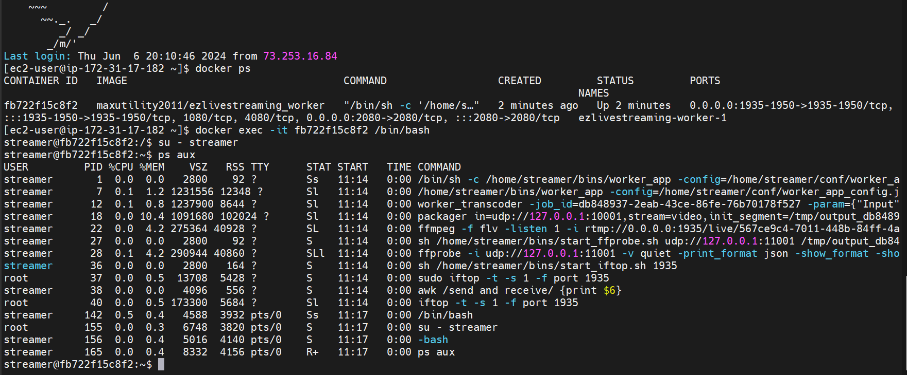

## Step 10: Feed your live channel
On your PC, open OBS studio to broadcast a live RTMP stream that contributes to the worker service of ezLiveStreaming. Go to the demo UI and copy the *rtmp_ingest_url* (returned by api_server after creating your live channel in Step 9), e.g., "rtmp://54.91.250.183:1936/live/5ae4760f-49a0-41a9-979d-005fe9c32834". In OBS, click "Settings" then click "Stream", the following screen will show up. 


In the above screen, copy-paste the RTMP URL address, e.g., "rtmp://54.91.250.183:1936/live/" into the "Server" box, and the RTMP stream key, e.g., "5ae4760f-49a0-41a9-979d-005fe9c32834" into the "Stream Key" box. Click "OK" to save and apply the RTMP output settings. Then, click "Start Streaming" button in the main panel to start live broadcasting to ezLiveStreaming. If OBS returns no error, that means the live broadcasting is up and running. Otherwise, go back to Step 9 and verify if all the worker services are running. Failed OBS broadcasting has three possible causes,
1. ffmpeg or Shaka packager fails to start in worker container.
2. The TCP port (e.g., 1936) for RTMP ingest isn't open on the worker server. Please check your AWS EC2 security group for a list of open ports. A worker instance can run multiple concurrent live channels (limit to 15 channels in the code). Each channel is assigned its own port between 1935 and 1950. When a new channel is created, it is assigned the next higher port number, starting from 1935. When a channel stops, its port is reclaimed and returned to the available port pool. 
3. Also, check the hostname/ip_address in *rtmp_ingest_url*. Make sure it is a public IP. The worker service queries a IP detection service, "api.ipify.org" for its own public IP and put the IP in *rtmp_ingest_url*. 

It is also possible that Step 9 does not succeed and the new channel is not even created. If that is the case, you will not see any server response in the demo UI when you run Step 9. Also, make sure you have successfully started the worker service in Step 8. If that is the case, run "docker ps" on the worker server to verify worker container is running.

## Step 11: Verify live channel output to S3
Go to your AWS s3 console, click into your bucket, you will see a folder named like "output_4f115985-f9be-4fea-9d0c-0421115715a1/". The random string after "output_" is the live job id which should match the job id returned from the api_server in step 9. Click into the job media output folder, you will see media output like below,

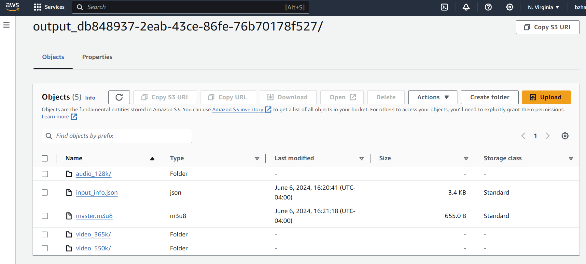

For HLS, media output include m3u8 playlists and sub-folders that contain media segments. 

However, if you don't see the job output folder in your bucket, that most likely indicates missing AWS access right. Log into your worker container again as in step 9, run 
```
vi /home/streamer/log/worker_transcoder_4f115985-f9be-4fea-9d0c-0421115715a1.log
```
to view the worker log. Remember to replace the random string in the log file name by the id of your live job. If you see S3 upload failure in the log, that means the worker service does not have write access to your S3 bucket. You may refer to Step 3 or use your own way to grant AWS access. Granting AWS access is out of scope of the development of ezLiveStreaming.

## Step 12: Playback
The live channel playback URL can be found in the botton-right corner of the demo UI, e.g., "https://bzhang-test-bucket-public.s3.amazonaws.com/output_4f115985-f9be-4fea-9d0c-0421115715a1/master.m3u8".
In the demo UI, I integrated Shaka player to play the live channel. After you started live OBS broadcasting in step 10, wait about 10-15 seconds then click the "play" button in the UI, you will see playback starts. The 10 seconds wait time is for the transcoder to start up (initialize, generate the first 2-3 media segments then upload to S3 bucket). You can also use Shaka player's official demo page (https://shaka-player-demo.appspot.com/demo) to play your live channel. If you stream with av1 video codec, I recommend using hls.js demo player (https://hlsjs.video-dev.org/demo) to play the streams. Shaka player also worked for av1, but I also had issues with some of its nightly builds. You must also check whether your browser supports av1 decoding. The latest version of Chrome supports AV1. If you are having issues with AV1, please feel free to contact me. If you haven't enabled allow-cors (cross-origin) in S3, the playback could fail due to CORS errors. In that case, you can install **Moesif CORS** browser extension and enable CORS then click "play" button again.

## Trouble-shooting

If you see the playback starts but has frequent player rebuffering, they could be caused by the following reasons,
1. The Internet connection isn't good on the machine running OBS. The live RTMP contribution stream does not have a good amount of bandwidth to be delivered.
2. The Internet connection isn't good on the machine running the video player. The live HLS/DASH stream does not have a good amount of bandwidth to be delivered.
3. The machine running OBS does not have enough CPU power available to generate the live video stream. 
4. The worker server (running ffmpeg and Shaka packager) does not have enough CPU power to transcode. You can look at the worker log (Step 11) for clues. If ffmpeg cannot transcode as fast as the real speed of the live video, it will log the errors and the errors are dumped to the worker log.
5. It can be also likely that you run too many live channels on the single worker server, or your live channels are configured with too many output renditions and/or the video transcoding settings are too high. Try to run fewer jobs (no more than 3 jobs on a c5.large instance), configure fewer output renditions for a job, or reduce video resolution, bitrate, frame rate, or use h.264 as the video codec instead of h.265.

For interesting users, a postman collection is included in this repository which contains sample internal/external API requests targetting individual services (api_server, job scheduler, worker, ezKey_server). You can also use redis-cli to view Redis tables. To access Redis, log into the management server container which hosts api_server, scheduler, ezKey_server and Redis, and run
```
redis-cli
```
ezLiveStreaming uses the default Redis port, 6379. A full list of all the Redis tables used by ezLiveStreaming can be found at the end of this document.

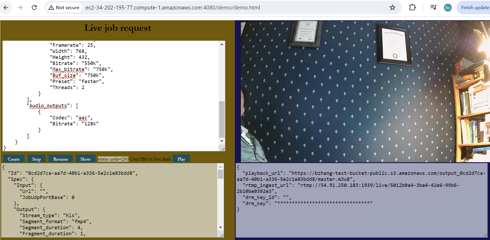

# Life cycle of a live job

The life cycle (state machine) of a live job is shown in the diagram below.
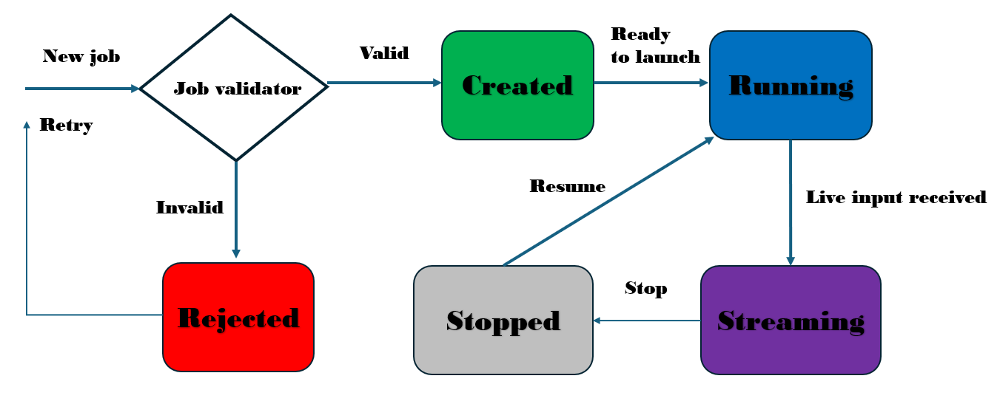

A live job can be in one of the 4 states at any moment: 
- *created*: When a new job request is received and passed the job validation, a new job is created.
- *running*: When a job is launched and running, but not ingesting (live input is yet to be received).
- *streaming*: When the live input is received and the live transcoder is ingesting, transcoding and outputting HLS/DASH stream.
- *stopped*: When the live channel is stopped. 

# List of API methods

## Create Job
Creating a new live transcoding request (a.k.a. live transcoding job or live job) <br>
**POST /jobs** <br>
**Request body**: JSON string representing the live job specification <br>
```
{
    "Output": {
        "Stream_type": "hls", 
        "Segment_format": "fmp4", 
        "Fragment_duration": 1, 
        "Segment_duration": 4, 
        "Low_latency_mode": 0, 
        "Time_shift_buffer_depth": 120,
        "Drm": {
                "Disable_clear_key": 0,
                "Protection_system": "FairPlay",
                "Protection_scheme": "cbcs"
        },
        "S3_output": {
            "Bucket": "bzhang-test-bucket-public"
        },
        "Video_outputs": [ 
            {
                "Label": "video365k", 
                "Codec": "h264", 
                "Framerate": 25, 
                "Width": 640, 
                "Height": 360, 
                "Bitrate": "365k", 
                "Max_bitrate": "500k", 
                "Buf_size": "500k", 
                "Preset": "faster", 
                "Threads": 2 
            },
            {
                "Label": "video550k",
                "Codec": "h264",
                "Framerate": 25,
                "Width": 768,
                "Height": 432,
                "Bitrate": "550k",
                "Max_bitrate": "750k",
                "Buf_size": "750k",
                "Preset": "faster",
                "Threads": 2
            }
        ],
        "Audio_outputs": [
            {
                "Label": "audio128k",
                "Codec": "aac",
                "Bitrate": "128k" 
            }
        ]
    }
}
```
**Response code** <br>
- on success: 201 created <br>
- on bad request: 400 bad request <br>
- on failure: 500 internal server error <br>
**Response body**: On success, the server returns the original request body, plus the created job ID, timestamps and job state/stats. Otherwise, the error message on why the request was rejected. <br>

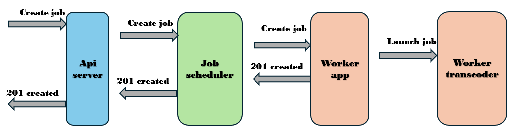

## Job validation
The api_server will validate the specification of each new job. A new job request will be rejected if it fails the validation. The server will return the specific errors for the rejection. Even if a new job request passes the validation and receives "201 created", it could still receive validation warnings. The warnings will be shown in the job response ("Job_validation_warnings").

## Transcoding parameter definitions

| Param | Data type | Definition | Valid values |
| --- | --- | --- | --- |
| Stream_type | string | stream type (protocol) | "hls", "dash" |
| Segment_format | string | media segment format | "fmp4" ("cmaf" and "ts" to be added) |
| Fragment_duration | integer | fragment (GOP) duration in second. Currently, this will set the closed GOP size and key frame interval | [0 - 10] |
| Segment_duration | integer | duration of segments in second | [0 - 10] |
| Low_latency_mode | boolean | whether low latency mode is used | 0/1 |
| Time_shift_buffer_depth | integer | DASH time_shift_buffer_depth in second (applicable to HLS too), i.e., DVR window size | [0 - 14400] |
| Drm | json | DRM configuration | n/a |
| Disable_clear_key | boolean | whether clear key DRM is disabled | 0/1 |
| Protection_system | string | DRM protection system | "FairPlay" (other systems to be added, e.g., "Widewine",  "PlayReady") |
| Protection_scheme | string | DRM protection (encryption) scheme | "cbcs", "cenc" |
| S3_output | json | S3 output configuration | n/a |
| Bucket | string | S3 bucket name | n/a |
| Video_outputs | json array | Array of video output renditions | n/a |
| Label | string | label of an output rendition | n/a |
| Codec (Video_outputs) | string | video codec | "h264" (libx264), "h265" (libx265), "av1" (libsvtav1) |
| Framerate | integer | output video frame rate | [0 - 60] |
| Width | integer | output video resolution (width) | < 1920 |
| Height | integer | output video resolution (height) | < 1080 |
| Bitrate | string | output video bitrate (corresponds to "-b:v" in ffmpeg). For example, "500k" | < 5000k |
| Max_bitrate | string | output video bitrate cap (corresponds to "-maxrate" in ffmpeg). For example, "750k" | < 2 x Bitrate |
|Buf_size | string | VBV buffer size (corresponds to "-bufsize" in ffmpeg). For example, "750k" | < 2 x Bitrate |
| Preset | string | video encoding speed preset (corresponds to "-preset" in ffmpeg) | same as libx264 or libx265 presets. >= 12 for av1 video codec |
| Threads | integer | number of encoding threads (corresponds to "-threads" in ffmpeg) per rendition | same as ffmpeg "-threads" values. >= 2 for h26x, >= 4 for av1 |
| Audio_outputs | json | array of audio outputs | n/a |
| Codec (Audio_outputs) | string | audio codec | "aac", "mp3" |

## Get all the jobs
Show all the jobs including currently running jobs and already finished jobs. <br>
**GET /jobs** <br>
**Request body**: None <br>
**Response code** <br>
- on success: 200 OK <br>
- on failure: 500 internal server error <br>
**Response body**: A JSON array that lists all the jobs. <br>

## Get one job
List a single job given by its ID. <br>
**GET /jobs/[job_id]** <br>
**Request body**: None <br>
**Response code** <br>
- on success: 200 OK <br>
- on failure: 500 internal server error <br>
- on invalid job id: 404 not found <br>
**Response body**: specified as follows <br>

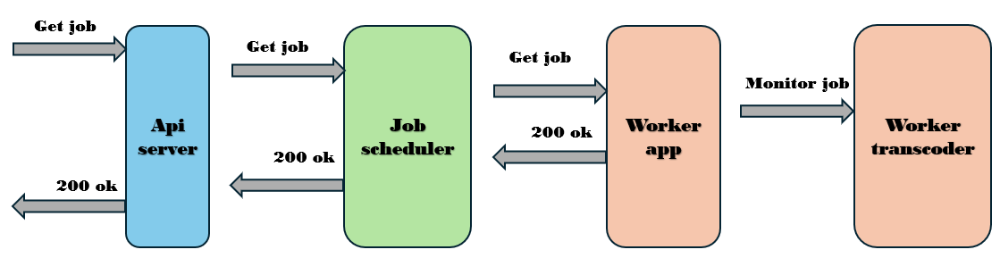

## Specification of job response
| Field | Definition | 
| --- | --- |
| Id | Job ID | 
| State | The job state. Valid values are: *created*, *running* (running but not ingesting, i.e., no input), *streaming* (ingesting and outputting, i.e., input is received and live transcoding is in progress), *stopped* (the live channel is stopped) | 
| Time_last_worker_report_ms | (**Stats**) Time in millisecond when the last report about this job is received from the assigned worker | 
| Ingress_bandwidth_kbps | (**Stats**) The bitrate (bandwidth) of the live input | 
| Transcoding_cpu_utilization | (**Stats**) The CPU utilization (%) by the live transcoder of this job | 
| Total_bytes_ingested | (**Stats**) Total bytes ingested since the job was created or last resumed | 
| Total_up_seconds | (**Stats**) Total elapsed seconds since the job was created | 
| Total_active_seconds | (**Stats**) Total seconds which this job has been actively ingesting/transcoding since it was created or last resumed | 
| Spec | Job request specification | 
| Job_validation_warnings | Warnings from job validation. Warnings are non-critical issues that might be of concern to the user, but do not prevent the system from creating and launching the live channel | 
| StreamKey | Stream key in the RTMP ingest URL |
| RtmpIngestPort | Port number in the RTMP ingest URL  |  
| Playback_url | The playback URL of the live channel | 
| Input_info_url | Download URL of the input info file (a json file). This file provides media detail of the input stream including A/V codec, video resolution, frame rate, audio sampling rate, audio channel configuration, etc. This file is generated by ffprobe. Input_info_url is only available after the live channel input starts. |
| Time_created | Time when the job was accepted and created (in human-readable format) | 
| Time_received_by_scheduler | Time when the job was received by the job scheduler (in human-readable format) | 
| Time_received_by_worker | Time when the job was received by the assigned live worker (in human-readable format) | 
| Assigned_worker_id | The ID of the worker to which this job is assigned | 
| DrmEncryptionKeyInfo.Key_id | DRM key ID | 
| DrmEncryptionKeyInfo.Content_id | DRM content ID. Same as job ID | 
| DrmEncryptionKeyInfo.Time_created | Time when the DRM key pair is created | 

The demo UI will periodically send GET one job request to refresh the job state and stats. The response body will be shown in the bottom-left corner and certain key information and job state/stats will be highlighted in the bottom-right corner. Also, you may like to constantly monitor the state and stats of your jobs. For example, the job state changes from "running" to "streaming" after you start pushing live input feed. The job stats such as ingress bandwidth usage and cpu usage change over time as well. A part of future work is to support streaming the job stats to data analytics platforms such as Datadog or Dynatrace, etc.

## Live stats

ezLiveStreaming supports display of live transcoding/streaming stats. To receive the live stats of a job, send a GET one job request to the server and the stats are included in the response. You may obtain the stats from the reponse and display them in the UI or feed them to your backend monitoring system. The list of stats are shown in the above table.

## Stop a job
Stop a job given by its ID. Upon request, the associated worker_transcoder instance will be stopped but the job info and states will remain in Redis. When the job is resumed in the future, the job ID, stream key and all the transcoding and packaging parameters remain the same. <br>

**PUT /jobs/[job_id]** <br>
**Request body**: None <br>
**Response code** <br>
- on success: 202 Accepted <br>
- on failure: 500 internal server error <br>
- on invalid job id: 404 not found <br>
- stopping a stopped job: 403 forbidden <br>
**Response body**: result <br>

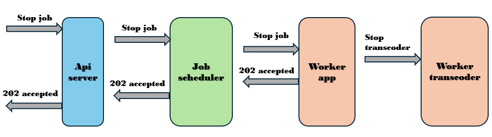

## Resume a job
Resume a job given by its ID. Upon request, the stopped job will be resumed. A new worker_transcoder instance will be launched. The job ID and stream key and all the transcoding and packaging parameters will be reused. <br>

**PUT /jobs/[job_id]** <br>
**Request body**: None <br>
**Response code** <br>
- on success: 202 Accepted <br>
- on failure: 500 internal server error <br>
- on invalid job id: 404 not found <br>
- resuming a running job: 403 forbidden <br>
**Response body**: result <br>

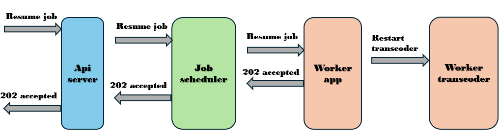

## Delete a job

Delete a job given by its ID. A job must be stopped first before it can be deleted. <br>

**DELETE /jobs/[job_id]** <br>
**Request body**: None <br>
**Response code** <br>
- on success: 200 OK <br>
- on failure: 500 internal server error <br>
- on invalid job id: 404 not found <br>
- deleting a running job: 403 forbidden <br>
**Response body**: result <br>

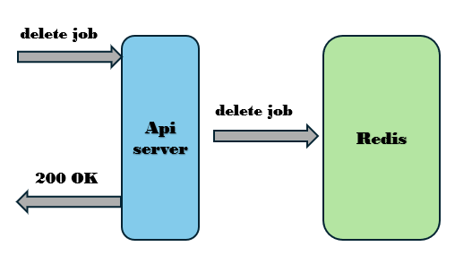

[doc/ezLiveStreaming.postman_collection.json](doc/ezLiveStreaming.postman_collection.json) provides sample API requests to ezLiveStreaming in a postman collection. <br>

The job scheduler periodically polls the job queue and fetches one job each time. The fetched job is inserted to the back of a Redis list named "queued_jobs". "queued_jobs" is a (scheduler) local queue for caching jobs that are taken off from SQS, but are yet to be scheduled. On the other side, another thread in job scheduler periodically checks the front of "queued_jobs" for new jobs. When a new job is found in the "queued_jobs", it is assigned to a transcoding worker from the worker cluster. Different job assignment algorithms can be used, such as random assignment, round robin assignment, etc. The job scheduler is responsible for managing a live job throughout its lifecycle, for example, assigning the job to a worker, monitoring its status, restarting/reassigning the job if it fails. 

The job scheduler also manages a cluster of live transcoding workers. Specifically, the scheduler assigns ID to each new worker when it starts. After that, the scheduler keeps monitoring heartbeats sent from the worker. Each worker also periodically reports job status and stats to the scheduler. If a job fails unexpectedly, the worker_app daemon can detect the termination of ffmpeg transcoder and Shaka packager, then reports the failure to the scheduler. The scheduler then removes the unexpectedly failed job from the active job list. After a job finishes either normally or unexpectedly, the scheduler updates the worker load by subtracting the estimated load (both cpu and bandwidth load) of the finished job from the current load of the corresponding worker in a timely manner, so that that worker becomes available for new jobs.

Though the job scheduler manages all the live jobs and live workers, it does not maintain any of their states in memory. Instead, they are all kept in Redis. Because of the stateless design, one can put a load balancer in front of a cluster of job scheduler instances, so that any one instance can be assigned by the load balancer to handle any job requests or worker events. 

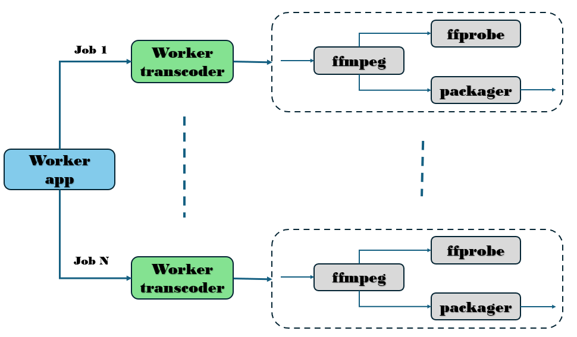

Each live worker is a virtual machine that runs ezLiveStreaming worker services. The worker runs a web service daemon called **worker_app** which communicates with the job scheduler to receive job requests, report job status, or worker status, etc. When the worker_app receives a live job request from the scheduler, it launches an instance of **worker_transcoder** to coordinate the execution of the job. Specifically, the worker_transcoder launches a ffmpeg transcoder and a Shaka packager to run a live video channel. The worker_transcoder follows the live job request to transcode and package the stream. *job/command.go* is responsible for translating the live encoding parameter to ffmpeg and Shaka packager command-line options.

When worker_app on a live worker first starts, it registers with the job scheduler and receives a worker ID assigned by the scheduler. After that worker_app needs to send periodic heartbeat to the scheduler so that the latter knows the former is still running. If no heartbeat is received from a worker for a certain length of time, the scheduler presumes that worker is no longer running so it deletes the worker from the active worker set and also stops all the live jobs running on that worker. The worker_app also handles **stop_job** requests and **resume_job** requests to stop a running job or resumes a stopped job. 

A worker_app not only handles normal job requests, it also handles unexpected job failures. To detect failed jobs, a worker_app periodically ping the live jobs (worker_transcoders) running on that worker VM. If a worker_transcoder does not respond, the worker_app presumes that the corresponding live job is no longer running. The worker_app reports the failed jobs to the job scheduler. The latter will adjust workload accordingly.

# DRM configuration

A simple clear key DRM key server is implemented to generate random 16 byte key-id and key upon requests. Each live channel receives an unique key-id and key pair. Specifically, api_server sends a key request to the key server when it receives a new transcoding job with DRM protection configured. The transcoding job ID is used as the content ID for the live channel. The key server generates a random 16 byte key_id and key pair then associate them with the content ID. The api_server receives the key response, parses the key materials from the response, then passes it to scheduler/worker_app/worker_transcoder along with the job request (including the DRM protection configuration). Worker_transcode translates the key materials and DRM configuration to Shaka packager DRM options when launching the packager. Lastly, the packager encrypts the live transcoded streams (received from ffmpeg) and outputs DRM-protected HLS streams. For clear-key DRM, a key file named *key.bin* is output and uploaded to S3. As per HLS specification, for clear key DRM, key.bin is a public file which contains the decrypt key in binary format. The S3 URI to *key.bin* is signaled by the *EXT-X-KEY* tag in the variant playlist. The player downloads the key file to obtain the key in order to decrypt the stream. However, clear-key DRM is ONLY for testing and debugging purposes. A full DRM workflow is needed to keep you content secure.

```
"Drm": {
    "Disable_clear_key": 0,
    "Protection_system": "FairPlay",
    "Protection_scheme": "cbcs"
},
```
Particularly we must set *Disable_clear_key* to 0 in order to use clear-key protection scheme. Supporting a full DRM workflow requires integration with 3rd party DRM services which I am happy to work on if sponsorship is provided. Currently, only video variants are DRM-protected, audio variants are not.

To play the clear-key DRM-protected HLS stream, I used Shaka player (https://shaka-player-demo.appspot.com/demo) and configured key_id and key. The following section is added to the Shaka player "extra config" section,
```
{
  "drm": {
    "clearKeys": {
      "6185c9f2cba899e585c61f046ac5bfe7": "459ad6f73d96190c8348d0059d71f77a"
    }
  }
}
```
Please replace the key_id and key with your own ones. The above configuration tells Shaka player what key to use to decrypt the HLS media segments. Next, copy-paste the HLS master playlist url into Shaka player demo (https://shaka-player-demo.appspot.com/demo) and hit "play" button. 

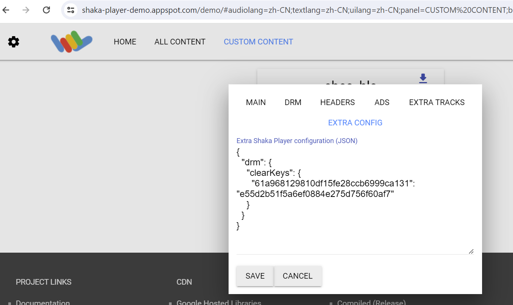

### How to get the DRM key_id and key
The DRM key_id (but not the decrypt key) can be found in the get_job response from api_server. Please use the key_id and get_drm_key request provided by ezKey_server (in the postman collection) to retrieve the decrypt key. Do NOT expose the ezKey_server API to the Internet!!! 

Alternatively, a DRM key info file (called key.json) is written to local disk (but not uploaded to S3) along with the key file (key.bin). The decrypt key can be found there.

Actually, the above DRM key configuration is not needed if you play the individual variant playlists instead of  the master playlist. Shaka player will download the key file (key.bin) which is given by the *URI* field in the *EXT-X-KEY* tag and get the decrypt key. I haven't figured out why individual variant playlists work but not the master.

# S3 output configuration

ezLiveStreaming supports uploading transcoder outputs to AWS S3 buckets. You can configure S3 media output via the "S3_output" section,
```
"S3_output": {
    "Bucket": "bzhang-test-bucket-public"
}
```
Currently, ezLiveStreaming does not support programmatic S3 authentication methods. You may configure AWS access key and secret key as environment variables on the worker VM, so that worker_transcoder has access to upload to the bucket.

# Code structure

[api_server/](api_server/) contains the implementation of a live streaming API server which handle requests to create/list/stop/resume live streams. <br>

[demo/](demo/) provides the implementation of a simple UI demo. <br>

[doc/](doc/) contains all the documentation.

[doc/diagrams/](diagrams/) groups together all the diagrams found in this document. <br>

[doc/ezLiveStreaming.postman_collection.json](doc/ezLiveStreaming.postman_collection.json) provides sample API requests to ezLiveStreaming in a postman collection. <br>

[docker/](docker/) provides all the dockerfiles for the different services. <br>

[drm_key_server/](drm_key_server/)  provides the implementation of a simple DRM key server. <br>

[job/](job/) contains the definition of API requests and live job states, and also contains source code for generating FFmpeg (or other encoder library such as GStreamer) commands that are used to execute a live job. <br>

[job_sqs/](job_sqs/) contains the implementation of a AWS Simple Queue Service (SQS) sender and receiver. The api_server sends new live jobs to the job queue (AWS SQS). The job scheduler periodically polls the job queue to receive new jobs. <br>

[model/](model/) contains various model definitions. <br>

[redis_client/](redis_client/) implements a redis client wrapper based on go_redis (https://github.com/redis/go-redis). <br>

[s3/](s3/) provides a AWS S3 client wrapper. <br>

[scheduler/](scheduler/) contains the implementation of a live job scheduler. Job scheduler receives new live jobs from the api_server via a AWS SQS job queue. Job scheduler also exposes API endpoints and receives new live worker registration requests from newly launched workers. <br>

[worker/](worker/) contains the implementation of live transcoding/streaming workers. The file *app/worker_app.go* implements the main application of the live worker. There is only one worker_app running on each live worker. worker_app receives live transcoding jobs from the job scheduler, launch new worker_transcoder (*worker/transcoder/worker_transcode.go*) to process live inputs and generate outputs, sends hearbeat periodically to the job scheduler, reports status of jobs and current workload to the job scheduler, etc. *worker/* also contains the Shaka packager binary "packager" (the nightly build from 05/2024). <br>

[compose.yaml](compose.yaml) is the docker compose file.

[specs/sample_live_job.json](specs/sample_live_job.json) provides a sample live job request with DRM protection configured. 

[specs/sample_live_job_without_drm.json](specs/sample_live_job_without_drm.json) provides a sample live job request without DRM protection configuration. <br>

[specs/sample_live_job_av1.json](specs/sample_live_job_without_drm.json) provides a sample live job request with AV1 video codec. <br>

Note that any modification to the sample jobs under *spec/* will be loaded automatically to the demo UI job template dropdown list. <br>

There are five executables, **api_server**, **job scheduler**, **worker_app**, **worker_transcoder** and **ezKey_server**. The entire live transcoding system consists of a cluster of api_server(s), a cluster of job schedulers, a cluster of redis servers and a cluster of live workers. Neither an api_server nor a job scheduler maintains any states of the live transcoding requests. The stateless design allows easy scalability and failover. As a result, one can put a load balancer (such as Nginx) in front of the api_server cluster and the job scheduler cluster. For example, you can use the "*upstream*" directive (https://docs.nginx.com/nginx/admin-guide/load-balancer/tcp-udp-load-balancer/) to specify a cluster of equivalent api_server instances which any one of them can handle the live transcoding requests. The api_server and job scheduler does not communicate directly, rather they communicate via the AWS SQS job queue and Redis. 

On each live worker VM, there runs one instance of worker_app which manages all the live jobs running on the VM. Each live job is executed by one instance of worker_transcoder which coordinates the live transcoder and the live packager to ingest, transcode and package the HLS/DASH live output stream. worker_app is a long-standing daemon while worker_transcoder only lives when a live job is still alive.

# Build and run individual services
This section provides instructions for building and running individual services when you don't want to use docker-compose to manage the services.

To build api_server, go to *api_server/* and run 
```
go build api_server_main.go
```
then start the server by running
```
./api_server_main -config=config.json
``` 
You can configure api_server_main in the config file. Specifically, you can configure the server hostname and network port, Drm key server url, and the AWS SQS job queue name and Redis server address in *api_server_main/config.json*. By default, the api_server listens for incoming live transcoding requests on http://0.0.0.0:1080/. This is also the base URL of any API endpoints that the server supports. You need to open port 1080 for incoming traffic to the Internet.

To build the job scheduler, go to *scheduler/* and run 
```
go build scheduler.go
``` 
then start the job scheduler by running 
```
./scheduler -config=config.json
``` 
You can configure scheduler in the config file. Specifically, you can set the server hostname and network port of the scheduler, and the AWS SQS job queue name and Redis server address in *scheduler/config.json*. By default, the scheduler listens for incoming requests on http://0.0.0.0:80/.

To build worker_app, go to *worker/app/* and run 
```
go build worker_app.go
``` 
then start the worker by running 
```
./worker_app -config=worker_app_config.json
```
The "*-config*" argument specifies the path to the worker_app configuration file. In the *worker_app_config.json*, you can configure,
- the hostname and network port of the worker_app. 
- the URL of the job scheduler. The worker_app sends heartbeat, reports status of jobs via this URL.
- the IP address or hostname, and network port of the worker VM on which the worker_app runs.
- WorkerUdpPortBase: the UDP port base used by the MPEG-TS streams between ffmpeg transcoder and Shaka packager. Since ffmpeg and Shaka packager run on the same VM, these ports are for internal use only.

To build ezKey_server, go to *drm/* and run 
```
go build ezKey_server.go
``` 
then start the key server by running
```
./ezKey_server -config=config.json
```

# List of Redis data structures 
## "jobs": 
All live jobs. <br>
**Data structure**: hash table <br>
**key**: job id <br>
**value**: "type LiveJob struct" in job/job.go <br>

To view all jobs in redis-cli, run "hgetall jobs". <br>

## "queued_jobs": 
Jobs that are pulled from the SQS job queue by job scheduler, but yet to be scheduled. <br>
**Data structure**: list <br>
**value**: string of "type LiveJob struct" (job/job.go) <br>

## "workers":
The set of live workers currently being managed by the job scheduler. <br>
**Data structure**: hash table <br>
**key**: worker id <br>
**value**: string of "type LiveWorker struct" (models/worker.go) <br>

To view all workers in redis-cli, run "hgetall workers". 

## "worker_loads": 
The current load of a worker: list of jobs running on the worker and its CPU and bandwidth load. <br>
**Data structure**: hash table <br>
**key**: worker id <br>
**value**: "type LiveWorker struct" in models/worker.go <br>

## "drm_keys":
This table stores all the DRM keys. <br>
**Data structure**: hash table <br>
**key**: DRM key id <br>
**value**: "type KeyInfo struct" in models/drm.go <br>

# Limitation
## AV1
The current implementation uses libsvtav1 for live AV1 transcoding. In order to transcode at real-time speed, the encoder preset has to be set to 12. Further evaluation has to be done to assess the impact on video quality.

## About the demo UI
The simple demo UI is designed to only serve a single live job. Each time a new job is to be created, the demo UI page needs to be refreshed. The page refresh will automatically send out a *stop_job* request to api_server to clean up the old job.

However, all the job states are kept in Redis and are ready to be served via ezLiveStreaming's Web API. All you need to do is to implement a Web catalog system for creating and managing your live jobs. For example, your catalog system may provide a page for creating a new job and a landing page for listing all the current jobs. If users click on a specific job from the landing page, they are directed to a per-job page that shows the detail of that job or they can also stop, reconfigure then resume the job. All these behaviors are backed by the web API of ezLiveStreaming and its backend functions.