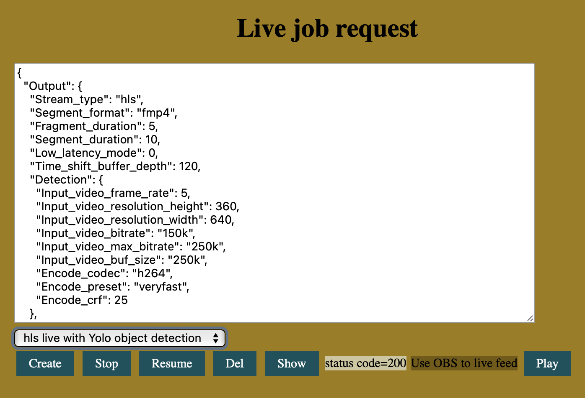
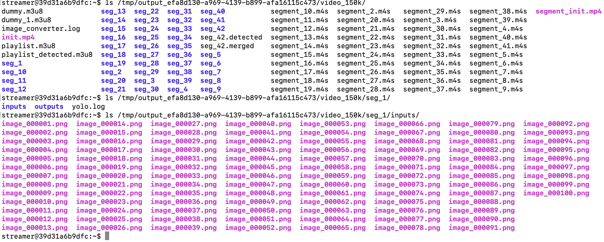

# Real-time object detection with ezLiveStreaming
ezLiveStreaming leverages AI models to enables real-time object detection, enabling the identification of objects in live video streams. Users can enable object detection in their live job specifications and configure detected video outputs with object annotations in HLS streaming format. Though many video-based applications support video object detection, to my knowledge, ezLiveStreaming is the first open-source live transcoding service to offer this feature. 

With object detection, ezLiveStreaming enables a wide range of real-time RoI (Region of Interests) identification applications, such as match score and jersey number recognition in sports, object counting, crowd monitoring, obstacle detection, traffic sign recognition and intruder detection. 

This document provides a detailed review of its overall system design, AI inference process, and video processing workflow.

## Overview
ezLiveStreaming uses YOLOv8 (You Only Look Once) AI model for detecting objects in live video streams. In the JSON live job requests, users can configure the object detection settings. For example, they can request a separate annotated (detected) video output in addition to the main transcoded video outputs. They can also specify the video codec, resolution, frame rate and other encoder settings to be used for generating the annotated video output. The annotated output is packaged in HLS format which can be streamed in the same way as the main outputs.

When the API server receives a live job request with object detection enabled (i.e., with a detection configuration json block), it first validates the detection configuration. If the configuration is invalid, the live job is rejected. If the configuration contains fields with out-of-range or incompatible values, warnings will be returned along with the job responses. If the configuration is valid, the API server passes the job to the job scheduler which assigns the job to a live worker with sufficient computing power. Due to high computating demand of AI inference and live video transcoding, the assigned live worker must be powerful enough to run real-time Yolo inference (object detection). Delay in Yolo inference can cause interruption in streaming the live annotated video. A compute-optimized AWS instance such as c5.4xlarge is recommended to be the live worker for object detection.

On a live worker, the worker_transcoder process is responsible for allocating resources for object detection as well as coordinating various pre-detection, detection and post-detection tasks. Specifically, worker_transcoder adds a separate encoding thread (within FFmpeg transcoder) and packaging thread (within Shaka packager) for generating the **detection target output**. **Detection target output** is a dedicated video rendition output (with an HLS variant playlist and a stream of video segments) to be fed to the object detector for AI inference and object annotation. For every video segment (e.g., a fmp4 video segment) in the detection target output, worker_transcoder launches a separate detector process to pre-process, run detection and output the annotated video segment. This annotated video segment is then uploaded to the cloud storage for delivery. Worker_transcoder also maintains and updates the variant playlist for live-streaming the annotated video segments to end users using HLS.

The Yolo detection/inference workflow is developed in Python and shell scripts in the github repo [od_yolov8](https://github.com/maxutility2011/od_yolov8). The scripts take one self-initialized video segment as input, convert the video segment into a sequence of images, run object detection on the images, then re-encode the annotated images to an annotated video segment. 

Next, the worker_transcoder reads the annotated video segment, extracts and saves the initialization section (**MOOV**) as init segment, and extract and save the media data section (**MOOF** and **MDAT**) as video data segment, then uploads them to cloud storage. Also, whenever a video data segment is uploaded, worker_transcoder updates the HLS variant playlist to add that segment for live streaming and upload the playlist to cloud storage as well. 

Due to high computating demand, the output video resolution and frame rate of a detection target must be limited to avoid long inference time and hence interruption of the live annotated stream. On the other side, video resolution can't be set too low as doing so may have a negative impact on object detection accuracy.

## Configuration of object detection in live jobs
Object detection can be configured by adding a "Detection" block under "Output". "Detection" is parallel to "Video_outputs" which are both subblocks under "Output".
```
{
  "Output": {
    "Stream_type": "hls",
    "Segment_format": "fmp4",
    "Fragment_duration": 5,
    "Segment_duration": 10,
    "Low_latency_mode": 0,
    "Time_shift_buffer_depth": 120,
    "Detection": {
      "Input_video_frame_rate": 10,
      "Input_video_resolution_height": 180,
      "Input_video_resolution_width": 320,
      "Input_video_bitrate": "150k",
      "Input_video_max_bitrate": "250k",
      "Input_video_buf_size": "250k",
      "Encode_codec": "h264",
      "Encode_preset": "veryfast",
      "Encode_crf": 25
    }
    ......
  }
}
```
The "Detection" block is divided into two sections. 

Any fields with "Input_" prefix are the encoding parameters used by transcoder and packager to generate the **detection target output**. The prefix "Input_" indicates these configuration fields are for generating the **input** to the object detector.
| Field | Definition | Data type | Comments | Default value |
| --- | --- | --- | --- | --- |
| Input_video_frame_rate | Frame rate of video inputs to the object detector | integer | Object detector will break each input video segment to **fr** number of images where **fr** is the input video frame rate. | 10 |
| Input_video_resolution_height | Height (pixels) of the video input to the detector | integer | | 320 |
| Input_video_resolution_width | Width (pixels) of the video input to the detector | integer | | 180 |
| Input_video_bitrate | Target bitrate used by the transcoder when generating the video input to the detector | string | | "150k" |
| Input_video_max_bitrate | Max. bitrate used by the transcoder when generating the video input to the detector | string | | "250k" |
| Input_video_buf_size | VBV buffer size used by the transcoder when generating the video input to the detector | string | | "250k" |

All other fields are for re-encoding the annotated images to a single output video segment. 
| Field | Definition | Data type | Comments | Default value |
| --- | --- | --- | --- | --- |
| Encode_codec | Codec used by the video transcoder and re-encoder | string | The video transcoder and video re-encoder use the same codec as specified by *Encode_codec*. Only h264 is allowed (h265 to be supported). | "h264" |
| Encode_preset | Preset used by the video re-encoder | string | | "veryfast" | 
| Encode_crf | CRF used by video re-encoder | integer | | 25 | 

Note that the transcoder only uses H.264 for transcoding the **detection target output**. AV1 is not used. Configuring AV1 or h265 for *Encode_codec* would result in job validation warnings and the default value *h264* being used instead.

You can also configure detected/annotated output only without outputting any main transcoder outputs. To do that, add the *Detection* block but leave the *Video_outputs* block empty. In this way, users can stream a fixed-bitrate annotated video only without outputting any ABR transcoded video.

The API server validates the detection configuration before it creates the live job. If fields are missing, their default values shall be used, and validation warnings are returned.  

The demo UI provides a sample object detection job.
.

## Pre-detection processing
When a live job with detection enabled (called **live detection job**) is launched on a worker, a worker_transcoder process is created to handle both live transcoding and object detection. The worker_transcoder first checks to see if detection is enabled in a job spec. If so, worker_transcoder combines the detection target output with the list of main video outputs so that the transcoder (FFmpeg) and packager (Shaka packager) can generate the target output for the consumption of object detector. Worker_transcoder also adds the subfolder holding the detection target output data (HLS playlist and media segments) to its watch folder list. When new segments and playlist are written/updated under that subfolder, worker_transcoder is notified and a series of video processing and object detection tasks will be executed to process the files. 

When worker_transcoder's file watcher finds the HLS master playlist or any type of output files in a non-detection target output rendition, the new files are uploaded immediately to cloud storage as they don't need to go through object detection. If the file is a detection target variant playlist that is newly created or updated (note that update of variant playlists happens constantly during a live streaming event), it should not be uploaded directly. This is because detection target variant playlist contains output video segments that are generated straight from Shaka packager. These un-annotated segments are not delivery-ready to viewers of the detected/annotated videos. Rather, a new annotated variant playlist must be created to contain annotated segments after they are generated by the object detector. The annotated segments are added to the annotated playlist only after they finishes object detection and are uploaded to cloud storage. Finally, the annotated playlist can be uploaded and the annotated segments can be made available for live streaming. 

If the file watcher finds a detection target video initialization segment (containing **MOOV** box only), it caches the local storage path of the init segment and the segment will be used later. Note that the content of init segments do not change during a live streaming event unless video encoder reconfiguration happens (which is not allowed in ezLiveStreaming). 

If the file watcher finds a detection target video data segment (containing **MOOF** and **MDAT** boxes), the file watcher loads the init segment and concatenates it with the video data segment. The concatenation outputs a self-initialized video segment with both the initialization section and data section. The concatenation step is needed because the object detector requires self-initialized video segments as input. Specifically, the object detector converts a video segment into a sequence of images. The segment-to-images conversion requires the initialization section. Next, a new object detection job is created and inserted into the detection job queue. Worker_transcoder uses a separate monitor thread to fetch detection jobs from the queue and executes the job (i.e., run object detection tasks on the input video segment). 

## Object detection
The detection job monitor thread (started by the worker_transcoder main thread) periodically polls the queue for new detection jobs. The thread only executes the job if the number of currently running detection jobs does not exceed a hardcoded maximum allowed number. Limiting the number of running detection jobs can prevent overloading the live worker and causing interruption of the live annotated video streaming since Yolo inference is highly compute-intensive. The execution of detection jobs runs in their own threads (called detector threads), so they does not block the detection job monitor thread.

Each detector thread runs the object detection scripts that reside in a different Github repo, https://github.com/maxutility2011/od_yolov8. In that repo, [od.sh](https://github.com/maxutility2011/od_yolov8/blob/main/od.sh) is the main script executed by a detector thread when executing a detection job. It contains 3 major steps. First, it runs FFmpeg to convert the input video segment file to a sequence of images. Second, it runs [yolo.py](https://github.com/maxutility2011/od_yolov8/blob/main/yolo.py), the Yolo inference process on the sequence of un-annotated input images to generate a sequence of annotated output images. Third, it runs FFmpeg to merge and re-encode the annotated images to a single output video segment file. 

### Input video to image conversion
The input video file (i.e., a self-initialized media segment) is broken into **Fr * Dur** number of images using FFmpeg. **Fr** is given by **Input_video_frame_rate** in the live job. **Dur** is the duration of the input video file. For example, if Input_video_frame_rate is 10 fps and input video duration is 10 secs, the input video will be broken into 100 images. 

### Yolo inference
The Yolo inference script, [yolo.py](https://github.com/maxutility2011/od_yolov8/blob/main/yolo.py) reads un-annotated images from the input folder, runs inference on the images, and writes the annotated images to the output folder. Yolov8 is used for the image inference. All the prerequisites by running Yolov8 inference (e.g., pytorch, ultralytics, Yolo model file) are pre-installed in the docker image of live worker so that the Python script can run directly without the need to download the model file first. This saves some inference time.

On my c5.4xlarge instance without GPU acceleration, inferring one 320x180 image takes about 50ms. That means the input video frame rate cannot be higher than 20 fps, otherwise we won't be able to infer/detect the whole video segment in real-time speed. Since loading and initialing the Yolo model also takes time, in practice a c5.4xlarge instance will not be capable of supporting an input frame rate of 20 fps, i.e., detecting 20 images per second. However, on machines with the capability of GPU acceleration, the inference performance can be significantly boosted. A future work will be upgrading [yolo.py](https://github.com/maxutility2011/od_yolov8/blob/main/yolo.py) to support running Yolov8 inference on GPU(s).

For each input media segment file, a subfolder is created to hold the intermediate files and log files, e.g., input images, output images, Yolo script log files, FFmpeg re-encoder's log file. For example, od.sh creates subfolder *seg_1* under */tmp/output_efa8d130-a969-4139-b899-afa16115c473/video_150k/* when processing input video file, *seg_1.mp4*. The input images and output images are held under */tmp/output_efa8d130-a969-4139-b899-afa16115c473/video_150k/inputs and */tmp/output_efa8d130-a969-4139-b899-afa16115c473/video_150k/outputs*.



### Re-encoding
Next, the script [od.sh](https://github.com/maxutility2011/od_yolov8/blob/main/od.sh) uses FFmpeg to merge and re-encode the annotated output images into a single output video file in fragmented MP4 format. The output video is an annotated video segment. The MP4 video segment contains MOOV, SIDX, MOOF and MDAT boxes. Another argument to FFmpeg is the video timescale used in the original input video segment. We will cover this in the next section. Note that, the script [od.sh](https://github.com/maxutility2011/od_yolov8/blob/main/od.sh) does not change the duration of the video segment, so the annotated segment duration is same as the un-annotated segment duration.

## Post-detection processing
The output annotated video segments by [od.sh](https://github.com/maxutility2011/od_yolov8/blob/main/od.sh) are self-initialized mp4 files. To comply with HLS-fmp4 standard, we need to strip off the initialization section and save the initialization section and media data section separately. Specifically, we need to save the initialization section (**MOOV** box) in the initialization segment, e.g., "segment_init.mp4", and save the media data section (**SIDX**, **MOOF** and **MDAT** boxes) in media data segmentd, e.g., "segment_1.m4s". When a detector thread finishes Yolo inference, it continues job execution to convert the annotated mp4 segment to a fragmented mp4 segment and an init segment. The open-source video processing software **mp4box** by GPAC is used for this purpose. Specifically, **mp4box** converts the mp4 file input to an HLS stream with only one single fragmented video data segment in *.m4s* format, and one video initialization segment in *.mp4* format. The m4s segment only contains SIDX, MOOF and MDAT boxes. Format conversion using **mp4box** does not change the duration of the video segment, so the output file duration is same as the input file duration. The initialization segment contains only the MOOV box. **mp4box** also outputs a dummy HLS m3u8 file which is NOT used anywhere in the workflow.

The output fmp4 segment from **mp4box** still cannot be streamed directly using HLS due to non-continuous media timestamps across segments. When the FFmpeg re-encoder converts annotated images to mp4 video output, the timestamp of the re-encoded video frames always starts from 0. This will cause timestamp reset in the annotated (HLS) video stream every **D** seconds where **D** is the duration of media segments. In fact, in a working HLS stream, the media timestamp shall start from 0 when the very first video frame in a live channel is generated, and after that the timestamp shall increment monotonically throughout the lifetime of the channel. If timestamp resets for every segment, HLS playback will behave unexpectedly or even stops completely.

To fix the timestamp issue, we need to re-timestamp the fmp4 segments to make their timestamps continuous and monotonically increasing. Specifically, we need to extract and cache the timestamp of the original, un-annotated video segments, as well as the associated **timescale** (the time resolution used for representing the timestamps) when the segments just come out of Shaka packager. Next, after detection completes, we need to re-inject the original timestamp and timescale values into the output fmp4 segments. Because the object detection process does not change the duration of a video segment, the original timestamps can be re-used by the annotated segments and they should still be continuous and monotonically increasing. Preserving the original segment media timestamps allows the output fmp4 segments to be continuously playable in an HLS stream.

In detail, within the structure of a fmp4 segment, the timestamp of a video segment is stored in **BaseMediaDecodeTime** field of the **TRAF** box (inside **MOOF** box). The timescale is stored in the **SIDX** box. To extract and re-inject timestamps and timescales, I wrote an utility library, [media_utils](https://github.com/maxutility2011/media_utils). 

Finally, we need to update the HLS master playlist and generate the variant playlist for the annotated video rendition. First, the detection target rendition included in the original master playlist should be removed. During video packaging, Shaka packager includes detection target rendition in the master playlist because it cannot distinguish the detection target output rendition from main output renditions. However, we cannot leave detection target output rendition in the master playlist because that rendition with annotated video should not considered as a candidate for HLS Adaptive BitRate (ABR) switching. So it's detector thread's job to remove detection target rendition from the master playlist. Second, as mentioned, the original detection target variant playlist cannot be uploaded to cloud storage and be live-streamed directly, because of the video segments in the playlist have not gone through object detection and been annotated yet. Instead, the detector thread needs to create a new annotated playlist and adds an annotated video segment to the playlist only after it finishes all the detection processing. The annotated playlist is updated for every video segment.

The variant playlist url of the annotated video output is always formatted as follows,
``
http://[base_url]/video_[detection_target_output_bitrate]/playlist_detected.m3u8
``
For example, *https://bzhang-test-bucket-public.s3.us-east-1.amazonaws.com/output_efa8d130-a969-4139-b899-afa16115c473/video_150k/playlist_detected.m3u8*.